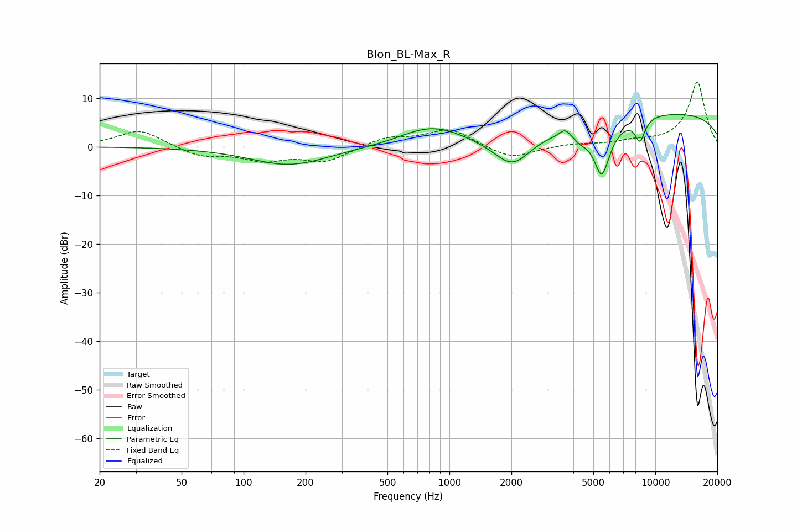

# Blon_BL-Max_R
See [usage instructions](https://github.com/jaakkopasanen/AutoEq#usage) for more options and info.

### Parametric EQs
Apply preamp of -6.7 dB when using parametric equalizer.

|   # | Type    |   Fc (Hz) |    Q |   Gain (dB) |
|-----|---------|-----------|------|-------------|
|   1 | Peaking |       167 | 0.74 |        -3.8 |
|   2 | Peaking |       821 | 1.08 |         5.2 |
|   3 | Peaking |       825 | 1.54 |        -1.4 |
|   4 | Peaking |      2028 | 1.43 |        -7   |
|   5 | Peaking |      3263 | 3.89 |        -0.1 |
|   6 | Peaking |      3644 | 5.51 |         1.5 |
|   7 | Peaking |      4297 | 3.75 |        -1.7 |
|   8 | Peaking |      5492 | 3.17 |       -11.2 |
|   9 | Peaking |      8423 | 5.31 |        -4.6 |
|  10 | Peaking |     10000 | 0.18 |         7.1 |

### Fixed Band EQs
When using fixed band (also called graphic) equalizer, apply preamp of **-13.4 dB** (if available) and set gains manually with these parameters.

|   # | Type    |   Fc (Hz) |    Q |   Gain (dB) |
|-----|---------|-----------|------|-------------|
|   1 | Peaking |        31 | 1.41 |         3.6 |
|   2 | Peaking |        62 | 1.41 |        -2   |
|   3 | Peaking |       125 | 1.41 |        -2.5 |
|   4 | Peaking |       250 | 1.41 |        -3   |
|   5 | Peaking |       500 | 1.41 |         1.9 |
|   6 | Peaking |      1000 | 1.41 |         3.6 |
|   7 | Peaking |      2000 | 1.41 |        -2.6 |
|   8 | Peaking |      4000 | 1.41 |         0.5 |
|   9 | Peaking |      8000 | 1.41 |         0.9 |
|  10 | Peaking |     16000 | 1.41 |        13.4 |

### Graphs

