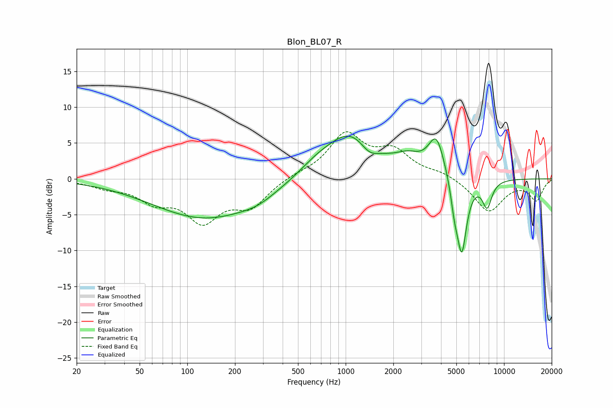

# Blon_BL07_R
See [usage instructions](https://github.com/jaakkopasanen/AutoEq#usage) for more options and info.

### Parametric EQs
Apply preamp of -6.0 dB when using parametric equalizer.

|   # | Type    |   Fc (Hz) |    Q |   Gain (dB) |
|-----|---------|-----------|------|-------------|
|   1 | Peaking |       130 | 0.42 |        -5.5 |
|   2 | Peaking |       278 | 1.3  |        -0.8 |
|   3 | Peaking |       654 | 1.21 |         1.3 |
|   4 | Peaking |      1077 | 0.88 |         6.3 |
|   5 | Peaking |      1409 | 2.47 |        -1.6 |
|   6 | Peaking |      2489 | 1.69 |         1.8 |
|   7 | Peaking |      3743 | 2.72 |         5.4 |
|   8 | Peaking |      4871 | 5.99 |        -2.9 |
|   9 | Peaking |      5408 | 4.32 |       -10.5 |
|  10 | Peaking |      7823 | 4.46 |        -3.7 |

### Fixed Band EQs
When using fixed band (also called graphic) equalizer, apply preamp of **-6.7 dB** (if available) and set gains manually with these parameters.

|   # | Type    |   Fc (Hz) |    Q |   Gain (dB) |
|-----|---------|-----------|------|-------------|
|   1 | Peaking |        31 | 1.41 |        -1   |
|   2 | Peaking |        62 | 1.41 |        -2.7 |
|   3 | Peaking |       125 | 1.41 |        -5.4 |
|   4 | Peaking |       250 | 1.41 |        -3.5 |
|   5 | Peaking |       500 | 1.41 |         0.5 |
|   6 | Peaking |      1000 | 1.41 |         6   |
|   7 | Peaking |      2000 | 1.41 |         3.5 |
|   8 | Peaking |      4000 | 1.41 |         0.8 |
|   9 | Peaking |      8000 | 1.41 |        -4.6 |
|  10 | Peaking |     16000 | 1.41 |        -2.9 |

### Graphs

