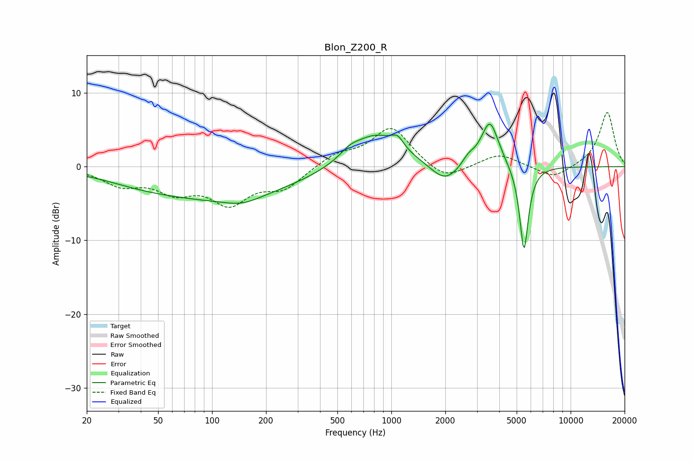

# Blon_Z200_R
See [usage instructions](https://github.com/jaakkopasanen/AutoEq#usage) for more options and info.

### Parametric EQs
Apply preamp of -5.9 dB when using parametric equalizer.

|   # | Type    |   Fc (Hz) |    Q |   Gain (dB) |
|-----|---------|-----------|------|-------------|
|   1 | Peaking |        38 | 0.73 |        -0.6 |
|   2 | Peaking |       113 | 0.33 |        -4.2 |
|   3 | Peaking |       147 | 1.44 |        -0.9 |
|   4 | Peaking |       585 | 2.72 |         0.8 |
|   5 | Peaking |       812 | 0.98 |         4.7 |
|   6 | Peaking |      1084 | 4.3  |         1.4 |
|   7 | Peaking |      1996 | 1.73 |        -2.7 |
|   8 | Peaking |      2689 | 3.97 |         1.1 |
|   9 | Peaking |      3544 | 2.85 |         6.3 |
|  10 | Peaking |      5493 | 5.61 |       -11.9 |

### Fixed Band EQs
When using fixed band (also called graphic) equalizer, apply preamp of **-7.4 dB** (if available) and set gains manually with these parameters.

|   # | Type    |   Fc (Hz) |    Q |   Gain (dB) |
|-----|---------|-----------|------|-------------|
|   1 | Peaking |        31 | 1.41 |        -2.2 |
|   2 | Peaking |        62 | 1.41 |        -2.9 |
|   3 | Peaking |       125 | 1.41 |        -4.5 |
|   4 | Peaking |       250 | 1.41 |        -2.7 |
|   5 | Peaking |       500 | 1.41 |         1.6 |
|   6 | Peaking |      1000 | 1.41 |         5.3 |
|   7 | Peaking |      2000 | 1.41 |        -2.1 |
|   8 | Peaking |      4000 | 1.41 |         1.8 |
|   9 | Peaking |      8000 | 1.41 |        -1.7 |
|  10 | Peaking |     16000 | 1.41 |         7.5 |

### Graphs

