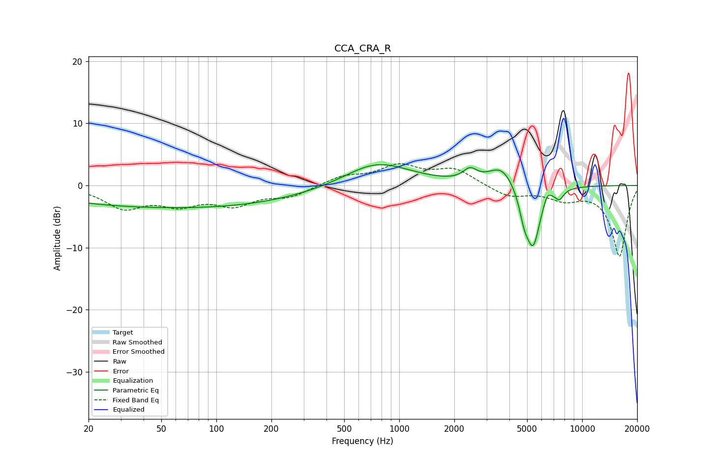

# CCA_CRA_R
See [usage instructions](https://github.com/jaakkopasanen/AutoEq#usage) for more options and info.

### Parametric EQs
Apply preamp of -3.4 dB when using parametric equalizer.

|   # | Type    |   Fc (Hz) |    Q |   Gain (dB) |
|-----|---------|-----------|------|-------------|
|   1 | Peaking |        35 | 0.29 |        -3.1 |
|   2 | Peaking |       182 | 0.41 |        -1.9 |
|   3 | Peaking |       653 | 1.28 |         0.3 |
|   4 | Peaking |       772 | 0.77 |         3.6 |
|   5 | Peaking |      2438 | 3.8  |         1.8 |
|   6 | Peaking |      3636 | 1.97 |         3.3 |
|   7 | Peaking |      4821 | 5.36 |        -3   |
|   8 | Peaking |      5393 | 3.36 |        -9.7 |
|   9 | Peaking |      6439 | 5.99 |         1.7 |
|  10 | Peaking |      7519 | 5.95 |        -1.4 |

### Fixed Band EQs
When using fixed band (also called graphic) equalizer, apply preamp of **-3.6 dB** (if available) and set gains manually with these parameters.

|   # | Type    |   Fc (Hz) |    Q |   Gain (dB) |
|-----|---------|-----------|------|-------------|
|   1 | Peaking |        31 | 1.41 |        -3.4 |
|   2 | Peaking |        62 | 1.41 |        -2.6 |
|   3 | Peaking |       125 | 1.41 |        -2.8 |
|   4 | Peaking |       250 | 1.41 |        -1.7 |
|   5 | Peaking |       500 | 1.41 |         1.4 |
|   6 | Peaking |      1000 | 1.41 |         3   |
|   7 | Peaking |      2000 | 1.41 |         2.5 |
|   8 | Peaking |      4000 | 1.41 |        -1.8 |
|   9 | Peaking |      8000 | 1.41 |        -1.9 |
|  10 | Peaking |     16000 | 1.41 |       -11.4 |

### Graphs

