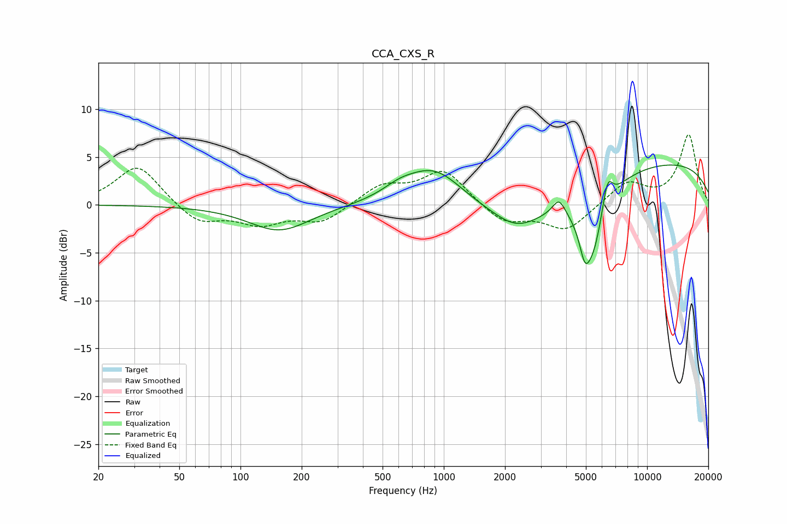

# CCA_CXS_R
See [usage instructions](https://github.com/jaakkopasanen/AutoEq#usage) for more options and info.

### Parametric EQs
Apply preamp of -4.3 dB when using parametric equalizer.

|   # | Type    |   Fc (Hz) |    Q |   Gain (dB) |
|-----|---------|-----------|------|-------------|
|   1 | Peaking |       155 | 0.94 |        -2.7 |
|   2 | Peaking |       605 | 1.68 |         0.9 |
|   3 | Peaking |       901 | 0.99 |         4   |
|   4 | Peaking |      2276 | 1.38 |        -1.6 |
|   5 | Peaking |      2683 | 0.52 |        -3.1 |
|   6 | Peaking |      3684 | 4.51 |         1.7 |
|   7 | Peaking |      4933 | 5.81 |        -2.4 |
|   8 | Peaking |      5380 | 2.23 |        -7.2 |
|   9 | Peaking |      6371 | 5.13 |         3.4 |
|  10 | Peaking |     10000 | 0.21 |         4.7 |

### Fixed Band EQs
When using fixed band (also called graphic) equalizer, apply preamp of **-7.4 dB** (if available) and set gains manually with these parameters.

|   # | Type    |   Fc (Hz) |    Q |   Gain (dB) |
|-----|---------|-----------|------|-------------|
|   1 | Peaking |        31 | 1.41 |         4.3 |
|   2 | Peaking |        62 | 1.41 |        -2   |
|   3 | Peaking |       125 | 1.41 |        -1.8 |
|   4 | Peaking |       250 | 1.41 |        -1.8 |
|   5 | Peaking |       500 | 1.41 |         2   |
|   6 | Peaking |      1000 | 1.41 |         3.6 |
|   7 | Peaking |      2000 | 1.41 |        -2   |
|   8 | Peaking |      4000 | 1.41 |        -2.7 |
|   9 | Peaking |      8000 | 1.41 |         2.4 |
|  10 | Peaking |     16000 | 1.41 |         7.3 |

### Graphs

