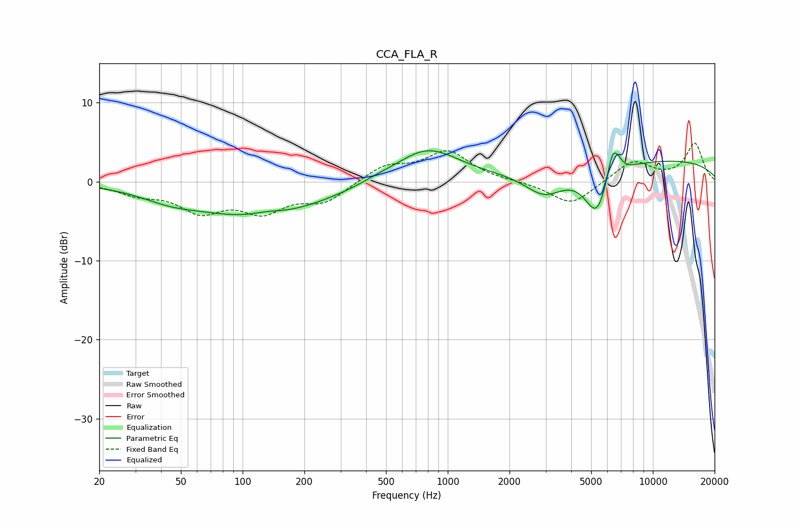

# CCA_FLA_R
See [usage instructions](https://github.com/jaakkopasanen/AutoEq#usage) for more options and info.

### Parametric EQs
Apply preamp of -4.0 dB when using parametric equalizer.

|   # | Type    |   Fc (Hz) |    Q |   Gain (dB) |
|-----|---------|-----------|------|-------------|
|   1 | Peaking |        44 | 1.09 |        -0.9 |
|   2 | Peaking |       118 | 0.43 |        -4.4 |
|   3 | Peaking |       132 | 1.81 |         0.5 |
|   4 | Peaking |       448 | 1.9  |         0.3 |
|   5 | Peaking |       791 | 0.91 |         4.3 |
|   6 | Peaking |      2959 | 1.47 |        -3.1 |
|   7 | Peaking |      5328 | 2.36 |        -5.9 |
|   8 | Peaking |      6346 | 5.19 |         3.7 |
|   9 | Peaking |      6778 | 5.89 |         0.9 |
|  10 | Peaking |      9961 | 0.23 |         2.8 |

### Fixed Band EQs
When using fixed band (also called graphic) equalizer, apply preamp of **-5.0 dB** (if available) and set gains manually with these parameters.

|   # | Type    |   Fc (Hz) |    Q |   Gain (dB) |
|-----|---------|-----------|------|-------------|
|   1 | Peaking |        31 | 1.41 |        -1.3 |
|   2 | Peaking |        62 | 1.41 |        -3.4 |
|   3 | Peaking |       125 | 1.41 |        -3.3 |
|   4 | Peaking |       250 | 1.41 |        -2.4 |
|   5 | Peaking |       500 | 1.41 |         2   |
|   6 | Peaking |      1000 | 1.41 |         3.7 |
|   7 | Peaking |      2000 | 1.41 |         0   |
|   8 | Peaking |      4000 | 1.41 |        -3   |
|   9 | Peaking |      8000 | 1.41 |         2.6 |
|  10 | Peaking |     16000 | 1.41 |         4.8 |

### Graphs

