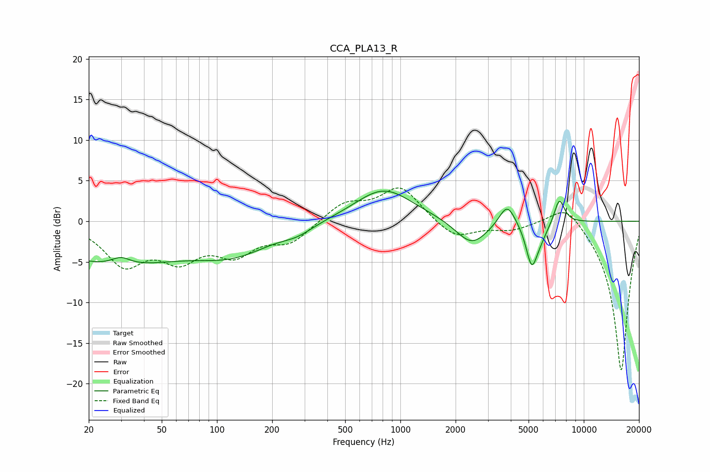

# CCA_PLA13_R
See [usage instructions](https://github.com/jaakkopasanen/AutoEq#usage) for more options and info.

### Parametric EQs
Apply preamp of -3.8 dB when using parametric equalizer.

|   # | Type    |   Fc (Hz) |    Q |   Gain (dB) |
|-----|---------|-----------|------|-------------|
|   1 | Peaking |        27 | 0.37 |        -5.1 |
|   2 | Peaking |        30 | 2.75 |         1   |
|   3 | Peaking |       125 | 0.67 |        -3.2 |
|   4 | Peaking |       274 | 1.69 |        -0.8 |
|   5 | Peaking |       812 | 0.89 |         4.1 |
|   6 | Peaking |      2449 | 1.62 |        -3.1 |
|   7 | Peaking |      3824 | 3.21 |         2.8 |
|   8 | Peaking |      5196 | 4.44 |        -4.9 |
|   9 | Peaking |      5781 | 3.13 |        -1.4 |
|  10 | Peaking |      7358 | 4.77 |         3.1 |

### Fixed Band EQs
When using fixed band (also called graphic) equalizer, apply preamp of **-4.2 dB** (if available) and set gains manually with these parameters.

|   # | Type    |   Fc (Hz) |    Q |   Gain (dB) |
|-----|---------|-----------|------|-------------|
|   1 | Peaking |        31 | 1.41 |        -5   |
|   2 | Peaking |        62 | 1.41 |        -4   |
|   3 | Peaking |       125 | 1.41 |        -3.5 |
|   4 | Peaking |       250 | 1.41 |        -2.4 |
|   5 | Peaking |       500 | 1.41 |         2.2 |
|   6 | Peaking |      1000 | 1.41 |         4.2 |
|   7 | Peaking |      2000 | 1.41 |        -2.2 |
|   8 | Peaking |      4000 | 1.41 |        -0.9 |
|   9 | Peaking |      8000 | 1.41 |         2.7 |
|  10 | Peaking |     16000 | 1.41 |       -18.6 |

### Graphs

