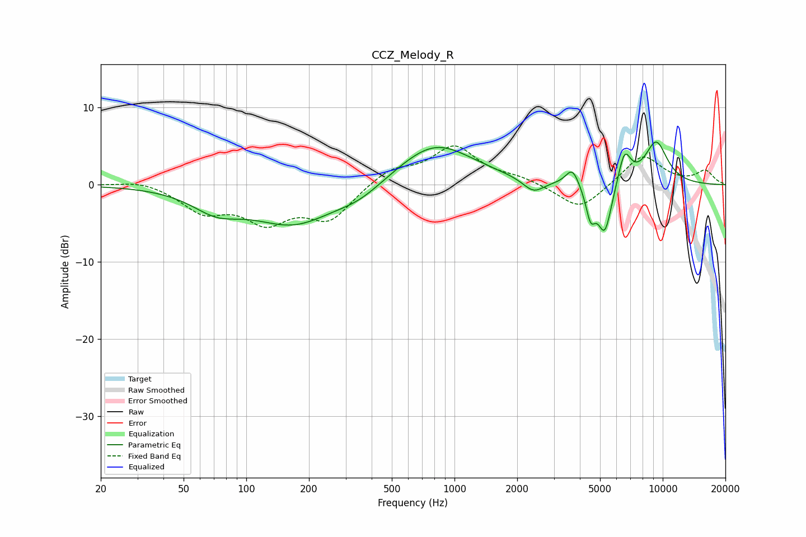

# CCZ_Melody_R
See [usage instructions](https://github.com/jaakkopasanen/AutoEq#usage) for more options and info.

### Parametric EQs
Apply preamp of -5.6 dB when using parametric equalizer.

|   # | Type    |   Fc (Hz) |    Q |   Gain (dB) |
|-----|---------|-----------|------|-------------|
|   1 | Peaking |        72 | 1.2  |        -2.5 |
|   2 | Peaking |       169 | 0.71 |        -4.9 |
|   3 | Peaking |       350 | 1.2  |        -1.5 |
|   4 | Peaking |       806 | 0.77 |         5.5 |
|   5 | Peaking |      2396 | 2.77 |        -1.7 |
|   6 | Peaking |      3680 | 4.47 |         2.3 |
|   7 | Peaking |      4504 | 6    |        -3.8 |
|   8 | Peaking |      5270 | 3.94 |        -6.6 |
|   9 | Peaking |      6551 | 4.41 |         4.2 |
|  10 | Peaking |      9302 | 2.24 |         5.5 |

### Fixed Band EQs
When using fixed band (also called graphic) equalizer, apply preamp of **-5.1 dB** (if available) and set gains manually with these parameters.

|   # | Type    |   Fc (Hz) |    Q |   Gain (dB) |
|-----|---------|-----------|------|-------------|
|   1 | Peaking |        31 | 1.41 |         0.7 |
|   2 | Peaking |        62 | 1.41 |        -3.2 |
|   3 | Peaking |       125 | 1.41 |        -4.3 |
|   4 | Peaking |       250 | 1.41 |        -4.3 |
|   5 | Peaking |       500 | 1.41 |         2   |
|   6 | Peaking |      1000 | 1.41 |         4.8 |
|   7 | Peaking |      2000 | 1.41 |         0.8 |
|   8 | Peaking |      4000 | 1.41 |        -3.4 |
|   9 | Peaking |      8000 | 1.41 |         3.9 |
|  10 | Peaking |     16000 | 1.41 |         1.7 |

### Graphs

