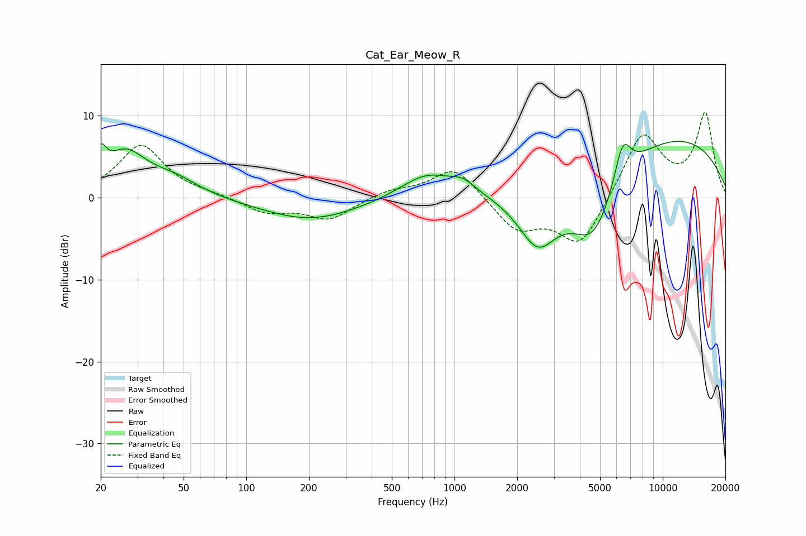

# Cat_Ear_Meow_R
See [usage instructions](https://github.com/jaakkopasanen/AutoEq#usage) for more options and info.

### Parametric EQs
Apply preamp of -7.0 dB when using parametric equalizer.

|   # | Type    |   Fc (Hz) |    Q |   Gain (dB) |
|-----|---------|-----------|------|-------------|
|   1 | Peaking |        20 | 5.57 |         3.1 |
|   2 | Peaking |        26 | 1.4  |         5.1 |
|   3 | Peaking |        45 | 1.17 |         1.9 |
|   4 | Peaking |       204 | 0.6  |        -2.8 |
|   5 | Peaking |       738 | 1.1  |         3   |
|   6 | Peaking |      1101 | 2.34 |         1.3 |
|   7 | Peaking |      2508 | 1.45 |        -6.9 |
|   8 | Peaking |      4644 | 1.16 |        -9.3 |
|   9 | Peaking |      6429 | 3.42 |         4.9 |
|  10 | Peaking |      9773 | 0.27 |         7.9 |

### Fixed Band EQs
When using fixed band (also called graphic) equalizer, apply preamp of **-10.5 dB** (if available) and set gains manually with these parameters.

|   # | Type    |   Fc (Hz) |    Q |   Gain (dB) |
|-----|---------|-----------|------|-------------|
|   1 | Peaking |        31 | 1.41 |         6.4 |
|   2 | Peaking |        62 | 1.41 |         0.3 |
|   3 | Peaking |       125 | 1.41 |        -1.8 |
|   4 | Peaking |       250 | 1.41 |        -2.6 |
|   5 | Peaking |       500 | 1.41 |         0.9 |
|   6 | Peaking |      1000 | 1.41 |         3.9 |
|   7 | Peaking |      2000 | 1.41 |        -3.9 |
|   8 | Peaking |      4000 | 1.41 |        -6   |
|   9 | Peaking |      8000 | 1.41 |         8   |
|  10 | Peaking |     16000 | 1.41 |        10.1 |

### Graphs

