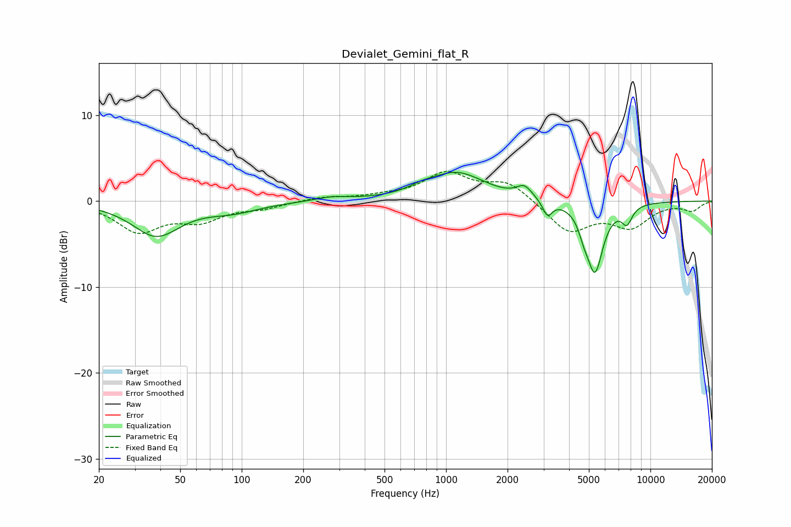

# Devialet_Gemini_flat_R
See [usage instructions](https://github.com/jaakkopasanen/AutoEq#usage) for more options and info.

### Parametric EQs
Apply preamp of -3.4 dB when using parametric equalizer.

|   # | Type    |   Fc (Hz) |    Q |   Gain (dB) |
|-----|---------|-----------|------|-------------|
|   1 | Peaking |        38 | 1.22 |        -3.9 |
|   2 | Peaking |        91 | 1.09 |        -1   |
|   3 | Peaking |       278 | 1.79 |         0.5 |
|   4 | Peaking |       761 | 2.32 |         0.5 |
|   5 | Peaking |      1124 | 1.02 |         3.2 |
|   6 | Peaking |      2419 | 3.76 |         1.3 |
|   7 | Peaking |      3137 | 6    |        -1.8 |
|   8 | Peaking |      4719 | 6    |        -1.3 |
|   9 | Peaking |      5350 | 3.42 |        -8   |
|  10 | Peaking |      7675 | 5.18 |        -2   |

### Fixed Band EQs
When using fixed band (also called graphic) equalizer, apply preamp of **-3.6 dB** (if available) and set gains manually with these parameters.

|   # | Type    |   Fc (Hz) |    Q |   Gain (dB) |
|-----|---------|-----------|------|-------------|
|   1 | Peaking |        31 | 1.41 |        -3.4 |
|   2 | Peaking |        62 | 1.41 |        -2   |
|   3 | Peaking |       125 | 1.41 |        -0.7 |
|   4 | Peaking |       250 | 1.41 |         0.5 |
|   5 | Peaking |       500 | 1.41 |         0.4 |
|   6 | Peaking |      1000 | 1.41 |         3.1 |
|   7 | Peaking |      2000 | 1.41 |         2.2 |
|   8 | Peaking |      4000 | 1.41 |        -3.6 |
|   9 | Peaking |      8000 | 1.41 |        -2.8 |
|  10 | Peaking |     16000 | 1.41 |        -1   |

### Graphs

