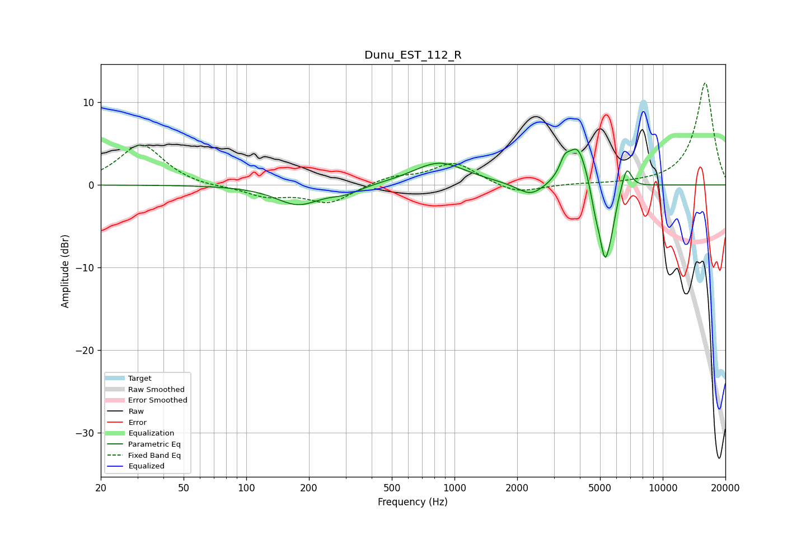

# Dunu_EST_112_R
See [usage instructions](https://github.com/jaakkopasanen/AutoEq#usage) for more options and info.

### Parametric EQs
Apply preamp of -4.4 dB when using parametric equalizer.

|   # | Type    |   Fc (Hz) |    Q |   Gain (dB) |
|-----|---------|-----------|------|-------------|
|   1 | Peaking |       177 | 1.33 |        -2.3 |
|   2 | Peaking |       300 | 1.92 |        -0.8 |
|   3 | Peaking |       846 | 1.11 |         2.8 |
|   4 | Peaking |      2327 | 2.18 |        -1.6 |
|   5 | Peaking |      3379 | 5.98 |         1.7 |
|   6 | Peaking |      3913 | 2.93 |         5.1 |
|   7 | Peaking |      4752 | 6    |        -2.2 |
|   8 | Peaking |      5278 | 4.95 |        -8.4 |
|   9 | Peaking |      5681 | 6    |        -2.1 |
|  10 | Peaking |      6709 | 5.79 |         2.8 |

### Fixed Band EQs
When using fixed band (also called graphic) equalizer, apply preamp of **-12.5 dB** (if available) and set gains manually with these parameters.

|   # | Type    |   Fc (Hz) |    Q |   Gain (dB) |
|-----|---------|-----------|------|-------------|
|   1 | Peaking |        31 | 1.41 |         4.9 |
|   2 | Peaking |        62 | 1.41 |        -0.3 |
|   3 | Peaking |       125 | 1.41 |        -1.3 |
|   4 | Peaking |       250 | 1.41 |        -2.2 |
|   5 | Peaking |       500 | 1.41 |         1   |
|   6 | Peaking |      1000 | 1.41 |         2.7 |
|   7 | Peaking |      2000 | 1.41 |        -1.2 |
|   8 | Peaking |      4000 | 1.41 |         0.1 |
|   9 | Peaking |      8000 | 1.41 |         0.1 |
|  10 | Peaking |     16000 | 1.41 |        12.5 |

### Graphs

