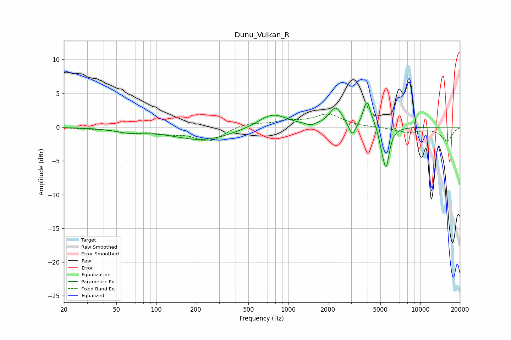

# Dunu_Vulkan_R
See [usage instructions](https://github.com/jaakkopasanen/AutoEq#usage) for more options and info.

### Parametric EQs
Apply preamp of -3.7 dB when using parametric equalizer.

|   # | Type    |   Fc (Hz) |    Q |   Gain (dB) |
|-----|---------|-----------|------|-------------|
|   1 | Peaking |        64 | 1.27 |        -0.6 |
|   2 | Peaking |       226 | 0.64 |        -1.9 |
|   3 | Peaking |       763 | 1.3  |         2.1 |
|   4 | Peaking |      1484 | 4.53 |        -0.3 |
|   5 | Peaking |      2292 | 2.96 |         2.8 |
|   6 | Peaking |      3065 | 5.48 |        -2   |
|   7 | Peaking |      3946 | 5.21 |         3.6 |
|   8 | Peaking |      4392 | 2.97 |         0.6 |
|   9 | Peaking |      5100 | 6    |        -1.4 |
|  10 | Peaking |      5519 | 5.41 |        -5.7 |

### Fixed Band EQs
When using fixed band (also called graphic) equalizer, apply preamp of **-2.0 dB** (if available) and set gains manually with these parameters.

|   # | Type    |   Fc (Hz) |    Q |   Gain (dB) |
|-----|---------|-----------|------|-------------|
|   1 | Peaking |        31 | 1.41 |        -0.1 |
|   2 | Peaking |        62 | 1.41 |        -0.7 |
|   3 | Peaking |       125 | 1.41 |        -0.7 |
|   4 | Peaking |       250 | 1.41 |        -2   |
|   5 | Peaking |       500 | 1.41 |         0.6 |
|   6 | Peaking |      1000 | 1.41 |         0.7 |
|   7 | Peaking |      2000 | 1.41 |         1.8 |
|   8 | Peaking |      4000 | 1.41 |        -0   |
|   9 | Peaking |      8000 | 1.41 |        -0.7 |
|  10 | Peaking |     16000 | 1.41 |        -2   |

### Graphs

