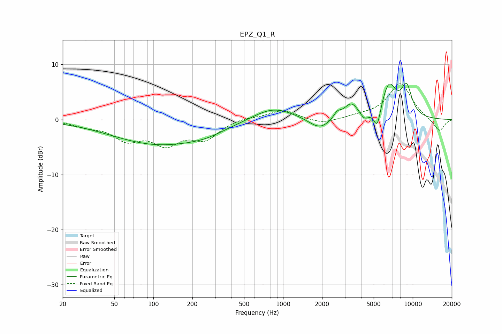

# EPZ_Q1_R
See [usage instructions](https://github.com/jaakkopasanen/AutoEq#usage) for more options and info.

### Parametric EQs
Apply preamp of -6.7 dB when using parametric equalizer.

|   # | Type    |   Fc (Hz) |    Q |   Gain (dB) |
|-----|---------|-----------|------|-------------|
|   1 | Peaking |       110 | 0.39 |        -4.4 |
|   2 | Peaking |       254 | 0.97 |        -0.8 |
|   3 | Peaking |       841 | 0.89 |         2.4 |
|   4 | Peaking |      1921 | 1.65 |        -2.2 |
|   5 | Peaking |      2614 | 4.93 |         1.1 |
|   6 | Peaking |      3359 | 2.51 |         2.9 |
|   7 | Peaking |      4231 | 4.11 |        -1.4 |
|   8 | Peaking |      5326 | 5.37 |        -3.8 |
|   9 | Peaking |      6541 | 2.35 |         6.1 |
|  10 | Peaking |      8961 | 3.1  |         5.3 |

### Fixed Band EQs
When using fixed band (also called graphic) equalizer, apply preamp of **-6.6 dB** (if available) and set gains manually with these parameters.

|   # | Type    |   Fc (Hz) |    Q |   Gain (dB) |
|-----|---------|-----------|------|-------------|
|   1 | Peaking |        31 | 1.41 |        -1   |
|   2 | Peaking |        62 | 1.41 |        -3.3 |
|   3 | Peaking |       125 | 1.41 |        -3.9 |
|   4 | Peaking |       250 | 1.41 |        -3.2 |
|   5 | Peaking |       500 | 1.41 |         0.5 |
|   6 | Peaking |      1000 | 1.41 |         1.8 |
|   7 | Peaking |      2000 | 1.41 |        -0.9 |
|   8 | Peaking |      4000 | 1.41 |         0.5 |
|   9 | Peaking |      8000 | 1.41 |         6.6 |
|  10 | Peaking |     16000 | 1.41 |        -2.3 |

### Graphs

