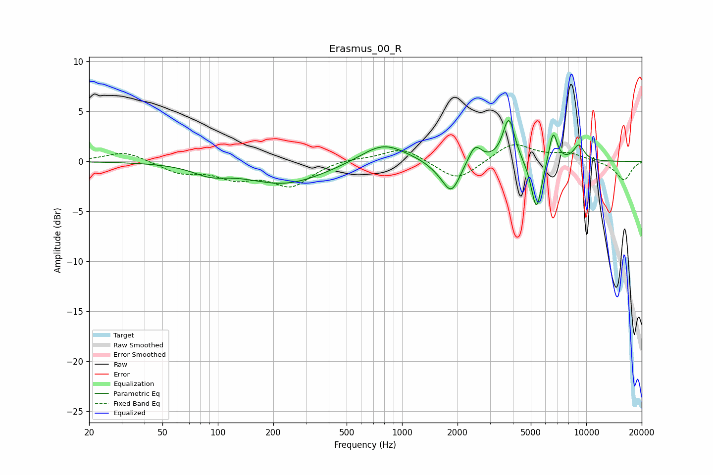

# Erasmus_00_R
See [usage instructions](https://github.com/jaakkopasanen/AutoEq#usage) for more options and info.

### Parametric EQs
Apply preamp of -4.2 dB when using parametric equalizer.

|   # | Type    |   Fc (Hz) |    Q |   Gain (dB) |
|-----|---------|-----------|------|-------------|
|   1 | Peaking |        91 | 1.53 |        -0.9 |
|   2 | Peaking |       231 | 0.65 |        -2.2 |
|   3 | Peaking |       790 | 1.14 |         2   |
|   4 | Peaking |      1576 | 2.24 |        -0.5 |
|   5 | Peaking |      1855 | 3    |        -3   |
|   6 | Peaking |      2487 | 3.94 |         1.8 |
|   7 | Peaking |      3799 | 4.36 |         4.4 |
|   8 | Peaking |      5368 | 4.82 |        -5.2 |
|   9 | Peaking |      6605 | 5.93 |         3.3 |
|  10 | Peaking |      9113 | 4.29 |         1.6 |

### Fixed Band EQs
When using fixed band (also called graphic) equalizer, apply preamp of **-1.8 dB** (if available) and set gains manually with these parameters.

|   # | Type    |   Fc (Hz) |    Q |   Gain (dB) |
|-----|---------|-----------|------|-------------|
|   1 | Peaking |        31 | 1.41 |         1   |
|   2 | Peaking |        62 | 1.41 |        -1.1 |
|   3 | Peaking |       125 | 1.41 |        -1.5 |
|   4 | Peaking |       250 | 1.41 |        -2.3 |
|   5 | Peaking |       500 | 1.41 |         0.3 |
|   6 | Peaking |      1000 | 1.41 |         1.4 |
|   7 | Peaking |      2000 | 1.41 |        -2   |
|   8 | Peaking |      4000 | 1.41 |         1.9 |
|   9 | Peaking |      8000 | 1.41 |         0.7 |
|  10 | Peaking |     16000 | 1.41 |        -1.9 |

### Graphs

