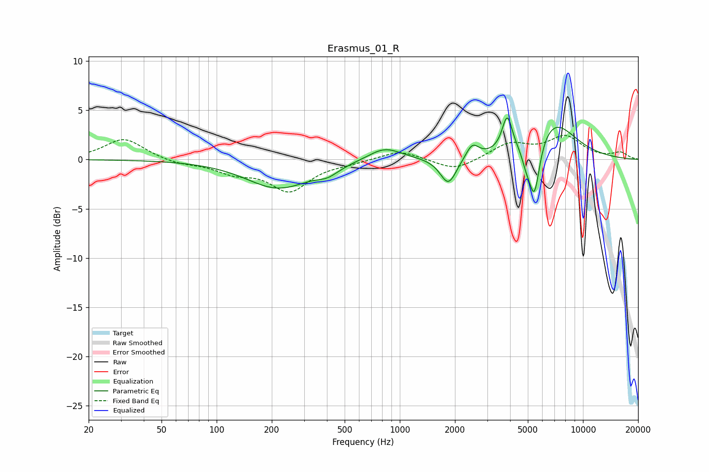

# Erasmus_01_R
See [usage instructions](https://github.com/jaakkopasanen/AutoEq#usage) for more options and info.

### Parametric EQs
Apply preamp of -4.3 dB when using parametric equalizer.

|   # | Type    |   Fc (Hz) |    Q |   Gain (dB) |
|-----|---------|-----------|------|-------------|
|   1 | Peaking |       217 | 0.82 |        -2.9 |
|   2 | Peaking |       218 | 2.07 |         0   |
|   3 | Peaking |       404 | 2.45 |        -0.7 |
|   4 | Peaking |       827 | 1.53 |         1.4 |
|   5 | Peaking |      1842 | 3.19 |        -2.7 |
|   6 | Peaking |      2488 | 4.09 |         1.5 |
|   7 | Peaking |      3859 | 5.04 |         3.6 |
|   8 | Peaking |      4889 | 5.99 |        -1.2 |
|   9 | Peaking |      5425 | 4.63 |        -5.9 |
|  10 | Peaking |      6874 | 1.11 |         3.9 |

### Fixed Band EQs
When using fixed band (also called graphic) equalizer, apply preamp of **-2.6 dB** (if available) and set gains manually with these parameters.

|   # | Type    |   Fc (Hz) |    Q |   Gain (dB) |
|-----|---------|-----------|------|-------------|
|   1 | Peaking |        31 | 1.41 |         2.2 |
|   2 | Peaking |        62 | 1.41 |        -0.4 |
|   3 | Peaking |       125 | 1.41 |        -1.2 |
|   4 | Peaking |       250 | 1.41 |        -3.1 |
|   5 | Peaking |       500 | 1.41 |        -0.3 |
|   6 | Peaking |      1000 | 1.41 |         1   |
|   7 | Peaking |      2000 | 1.41 |        -1.2 |
|   8 | Peaking |      4000 | 1.41 |         1.6 |
|   9 | Peaking |      8000 | 1.41 |         2.2 |
|  10 | Peaking |     16000 | 1.41 |         0.7 |

### Graphs

