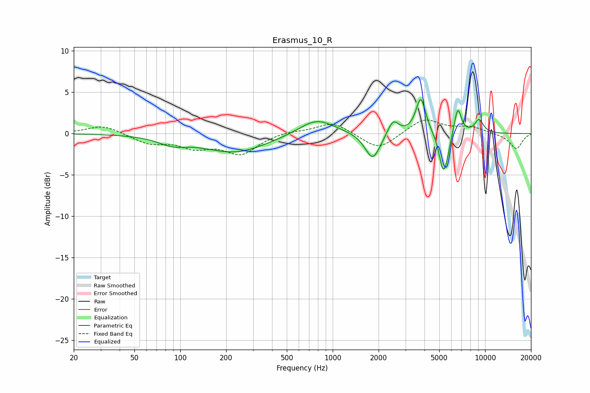

# Erasmus_10_R
See [usage instructions](https://github.com/jaakkopasanen/AutoEq#usage) for more options and info.

### Parametric EQs
Apply preamp of -4.2 dB when using parametric equalizer.

|   # | Type    |   Fc (Hz) |    Q |   Gain (dB) |
|-----|---------|-----------|------|-------------|
|   1 | Peaking |        89 | 1.54 |        -0.9 |
|   2 | Peaking |       228 | 0.67 |        -2.2 |
|   3 | Peaking |       783 | 1.22 |         1.9 |
|   4 | Peaking |      1831 | 2.82 |        -3.3 |
|   5 | Peaking |      2488 | 3.99 |         1.8 |
|   6 | Peaking |      3786 | 4.38 |         4.4 |
|   7 | Peaking |      5300 | 5.06 |        -4.4 |
|   8 | Peaking |      5622 | 6    |        -1.2 |
|   9 | Peaking |      6614 | 5.79 |         3.3 |
|  10 | Peaking |      9120 | 4.3  |         1.6 |

### Fixed Band EQs
When using fixed band (also called graphic) equalizer, apply preamp of **-1.7 dB** (if available) and set gains manually with these parameters.

|   # | Type    |   Fc (Hz) |    Q |   Gain (dB) |
|-----|---------|-----------|------|-------------|
|   1 | Peaking |        31 | 1.41 |         1.1 |
|   2 | Peaking |        62 | 1.41 |        -1.1 |
|   3 | Peaking |       125 | 1.41 |        -1.5 |
|   4 | Peaking |       250 | 1.41 |        -2.4 |
|   5 | Peaking |       500 | 1.41 |         0.3 |
|   6 | Peaking |      1000 | 1.41 |         1.4 |
|   7 | Peaking |      2000 | 1.41 |        -2   |
|   8 | Peaking |      4000 | 1.41 |         1.8 |
|   9 | Peaking |      8000 | 1.41 |         0.8 |
|  10 | Peaking |     16000 | 1.41 |        -1.9 |

### Graphs

