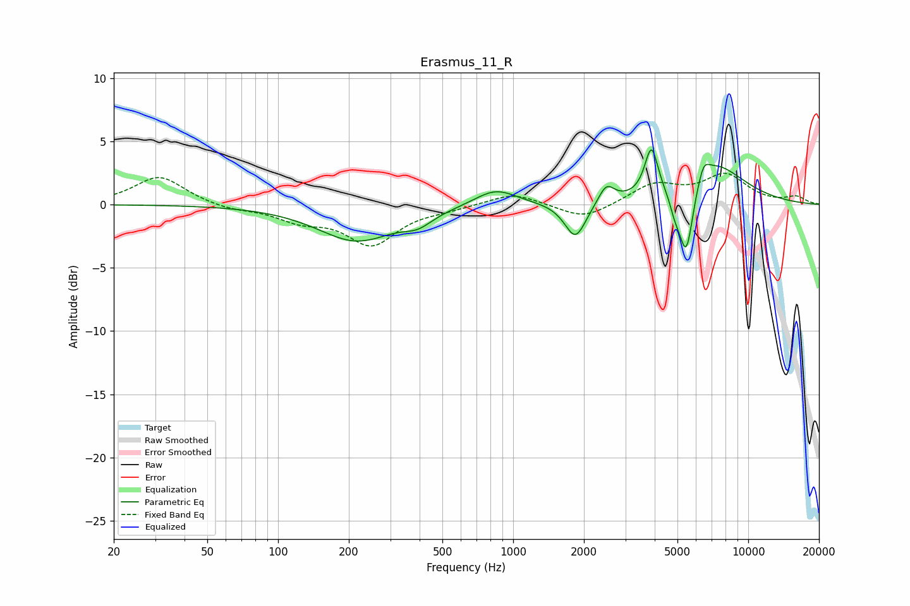

# Erasmus_11_R
See [usage instructions](https://github.com/jaakkopasanen/AutoEq#usage) for more options and info.

### Parametric EQs
Apply preamp of -4.4 dB when using parametric equalizer.

|   # | Type    |   Fc (Hz) |    Q |   Gain (dB) |
|-----|---------|-----------|------|-------------|
|   1 | Peaking |       216 | 0.86 |        -2.8 |
|   2 | Peaking |       394 | 2.33 |        -0.8 |
|   3 | Peaking |       842 | 1.57 |         1.4 |
|   4 | Peaking |      1841 | 3.12 |        -2.9 |
|   5 | Peaking |      2492 | 4.17 |         1.5 |
|   6 | Peaking |      3874 | 5.1  |         3.8 |
|   7 | Peaking |      4880 | 6    |        -1.3 |
|   8 | Peaking |      5450 | 4.49 |        -5.9 |
|   9 | Peaking |      6458 | 6    |         1.1 |
|  10 | Peaking |      6958 | 1    |         3.4 |

### Fixed Band EQs
When using fixed band (also called graphic) equalizer, apply preamp of **-2.6 dB** (if available) and set gains manually with these parameters.

|   # | Type    |   Fc (Hz) |    Q |   Gain (dB) |
|-----|---------|-----------|------|-------------|
|   1 | Peaking |        31 | 1.41 |         2.3 |
|   2 | Peaking |        62 | 1.41 |        -0.4 |
|   3 | Peaking |       125 | 1.41 |        -1.1 |
|   4 | Peaking |       250 | 1.41 |        -3.1 |
|   5 | Peaking |       500 | 1.41 |        -0.3 |
|   6 | Peaking |      1000 | 1.41 |         1   |
|   7 | Peaking |      2000 | 1.41 |        -1.2 |
|   8 | Peaking |      4000 | 1.41 |         1.6 |
|   9 | Peaking |      8000 | 1.41 |         2.2 |
|  10 | Peaking |     16000 | 1.41 |         0.6 |

### Graphs

