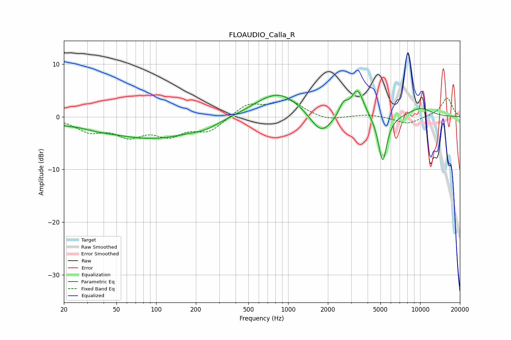

# FLOAUDIO_Calla_R
See [usage instructions](https://github.com/jaakkopasanen/AutoEq#usage) for more options and info.

### Parametric EQs
Apply preamp of -5.0 dB when using parametric equalizer.

|   # | Type    |   Fc (Hz) |    Q |   Gain (dB) |
|-----|---------|-----------|------|-------------|
|   1 | Peaking |        20 | 1.97 |        -0.5 |
|   2 | Peaking |        35 | 1.24 |        -0.6 |
|   3 | Peaking |        94 | 0.4  |        -4.1 |
|   4 | Peaking |       236 | 1.58 |        -0.7 |
|   5 | Peaking |       843 | 0.77 |         4.9 |
|   6 | Peaking |      1779 | 1.63 |        -4.4 |
|   7 | Peaking |      2620 | 4.21 |         2.3 |
|   8 | Peaking |      3356 | 3.02 |         5.2 |
|   9 | Peaking |      5195 | 4.15 |        -9   |
|  10 | Peaking |     10000 | 1.34 |         1.7 |

### Fixed Band EQs
When using fixed band (also called graphic) equalizer, apply preamp of **-3.6 dB** (if available) and set gains manually with these parameters.

|   # | Type    |   Fc (Hz) |    Q |   Gain (dB) |
|-----|---------|-----------|------|-------------|
|   1 | Peaking |        31 | 1.41 |        -2.5 |
|   2 | Peaking |        62 | 1.41 |        -3.2 |
|   3 | Peaking |       125 | 1.41 |        -3.1 |
|   4 | Peaking |       250 | 1.41 |        -2.6 |
|   5 | Peaking |       500 | 1.41 |         2.4 |
|   6 | Peaking |      1000 | 1.41 |         3   |
|   7 | Peaking |      2000 | 1.41 |        -0.8 |
|   8 | Peaking |      4000 | 1.41 |         0.5 |
|   9 | Peaking |      8000 | 1.41 |        -1.4 |
|  10 | Peaking |     16000 | 1.41 |         3.6 |

### Graphs

