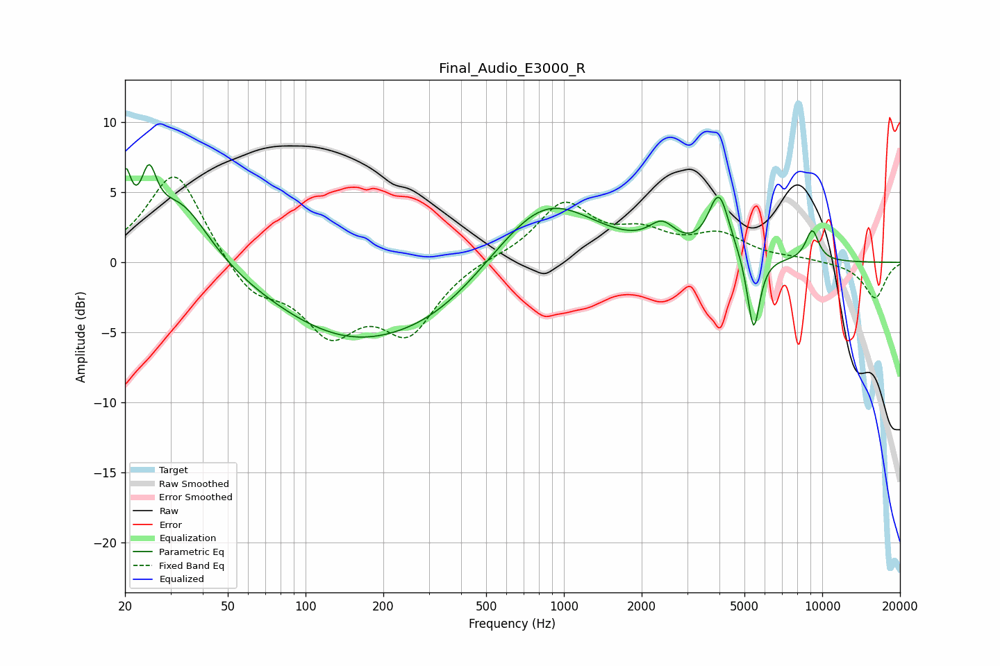

# Final_Audio_E3000_R
See [usage instructions](https://github.com/jaakkopasanen/AutoEq#usage) for more options and info.

### Parametric EQs
Apply preamp of -7.1 dB when using parametric equalizer.

|   # | Type    |   Fc (Hz) |    Q |   Gain (dB) |
|-----|---------|-----------|------|-------------|
|   1 | Peaking |        20 | 6    |         4.6 |
|   2 | Peaking |        25 | 4.75 |         3.9 |
|   3 | Peaking |        33 | 1.24 |         4.7 |
|   4 | Peaking |       153 | 0.45 |        -5.3 |
|   5 | Peaking |       340 | 0.74 |        -1.4 |
|   6 | Peaking |       846 | 0.73 |         4.9 |
|   7 | Peaking |      2399 | 2.69 |         1.7 |
|   8 | Peaking |      3982 | 3.42 |         4.5 |
|   9 | Peaking |      5424 | 5.78 |        -5.5 |
|  10 | Peaking |      9144 | 4.85 |         2.2 |

### Fixed Band EQs
When using fixed band (also called graphic) equalizer, apply preamp of **-6.2 dB** (if available) and set gains manually with these parameters.

|   # | Type    |   Fc (Hz) |    Q |   Gain (dB) |
|-----|---------|-----------|------|-------------|
|   1 | Peaking |        31 | 1.41 |         6.7 |
|   2 | Peaking |        62 | 1.41 |        -2.4 |
|   3 | Peaking |       125 | 1.41 |        -4.6 |
|   4 | Peaking |       250 | 1.41 |        -4.7 |
|   5 | Peaking |       500 | 1.41 |         0.3 |
|   6 | Peaking |      1000 | 1.41 |         4.1 |
|   7 | Peaking |      2000 | 1.41 |         1.7 |
|   8 | Peaking |      4000 | 1.41 |         1.8 |
|   9 | Peaking |      8000 | 1.41 |         0.2 |
|  10 | Peaking |     16000 | 1.41 |        -2.6 |

### Graphs

