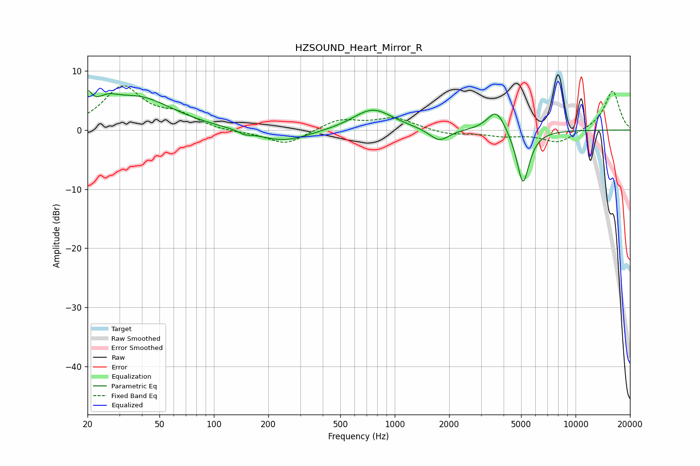

# HZSOUND_Heart_Mirror_R
See [usage instructions](https://github.com/jaakkopasanen/AutoEq#usage) for more options and info.

### Parametric EQs
Apply preamp of -6.7 dB when using parametric equalizer.

|   # | Type    |   Fc (Hz) |    Q |   Gain (dB) |
|-----|---------|-----------|------|-------------|
|   1 | Peaking |        20 | 5.88 |         3.2 |
|   2 | Peaking |        26 | 2.35 |         1.9 |
|   3 | Peaking |        38 | 0.74 |         5.3 |
|   4 | Peaking |       148 | 4.45 |        -0.5 |
|   5 | Peaking |       241 | 0.98 |        -2.1 |
|   6 | Peaking |       752 | 1.33 |         3.3 |
|   7 | Peaking |       807 | 1.08 |         0.4 |
|   8 | Peaking |      1764 | 2.57 |        -2.2 |
|   9 | Peaking |      3648 | 2.81 |         3.8 |
|  10 | Peaking |      5120 | 3.91 |        -9.4 |

### Fixed Band EQs
When using fixed band (also called graphic) equalizer, apply preamp of **-7.6 dB** (if available) and set gains manually with these parameters.

|   # | Type    |   Fc (Hz) |    Q |   Gain (dB) |
|-----|---------|-----------|------|-------------|
|   1 | Peaking |        31 | 1.41 |         7.1 |
|   2 | Peaking |        62 | 1.41 |         2.1 |
|   3 | Peaking |       125 | 1.41 |        -0.4 |
|   4 | Peaking |       250 | 1.41 |        -2.5 |
|   5 | Peaking |       500 | 1.41 |         1.8 |
|   6 | Peaking |      1000 | 1.41 |         2   |
|   7 | Peaking |      2000 | 1.41 |        -0.8 |
|   8 | Peaking |      4000 | 1.41 |        -0.9 |
|   9 | Peaking |      8000 | 1.41 |        -2.2 |
|  10 | Peaking |     16000 | 1.41 |         6.7 |

### Graphs

