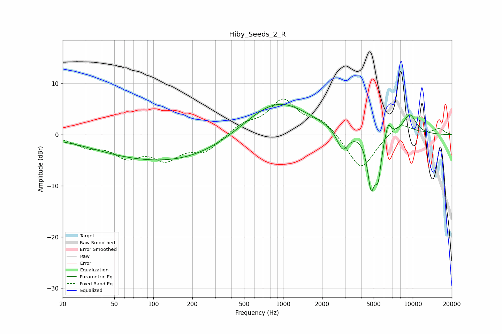

# Hiby_Seeds_2_R
See [usage instructions](https://github.com/jaakkopasanen/AutoEq#usage) for more options and info.

### Parametric EQs
Apply preamp of -6.0 dB when using parametric equalizer.

|   # | Type    |   Fc (Hz) |    Q |   Gain (dB) |
|-----|---------|-----------|------|-------------|
|   1 | Peaking |        28 | 0.81 |         0.1 |
|   2 | Peaking |       109 | 0.29 |        -4.9 |
|   3 | Peaking |       358 | 0.37 |        -1.2 |
|   4 | Peaking |       856 | 0.54 |         7.1 |
|   5 | Peaking |      1036 | 1.05 |         0.4 |
|   6 | Peaking |      2879 | 3.18 |        -4.2 |
|   7 | Peaking |      4770 | 4.88 |        -9.7 |
|   8 | Peaking |      5404 | 5.63 |        -6.9 |
|   9 | Peaking |      6456 | 6    |         2.9 |
|  10 | Peaking |      9478 | 2.38 |         3.9 |

### Fixed Band EQs
When using fixed band (also called graphic) equalizer, apply preamp of **-7.1 dB** (if available) and set gains manually with these parameters.

|   # | Type    |   Fc (Hz) |    Q |   Gain (dB) |
|-----|---------|-----------|------|-------------|
|   1 | Peaking |        31 | 1.41 |        -2   |
|   2 | Peaking |        62 | 1.41 |        -3.7 |
|   3 | Peaking |       125 | 1.41 |        -4.2 |
|   4 | Peaking |       250 | 1.41 |        -3.1 |
|   5 | Peaking |       500 | 1.41 |         1.9 |
|   6 | Peaking |      1000 | 1.41 |         6.6 |
|   7 | Peaking |      2000 | 1.41 |         2.6 |
|   8 | Peaking |      4000 | 1.41 |        -7.2 |
|   9 | Peaking |      8000 | 1.41 |         2.6 |
|  10 | Peaking |     16000 | 1.41 |         1.2 |

### Graphs

