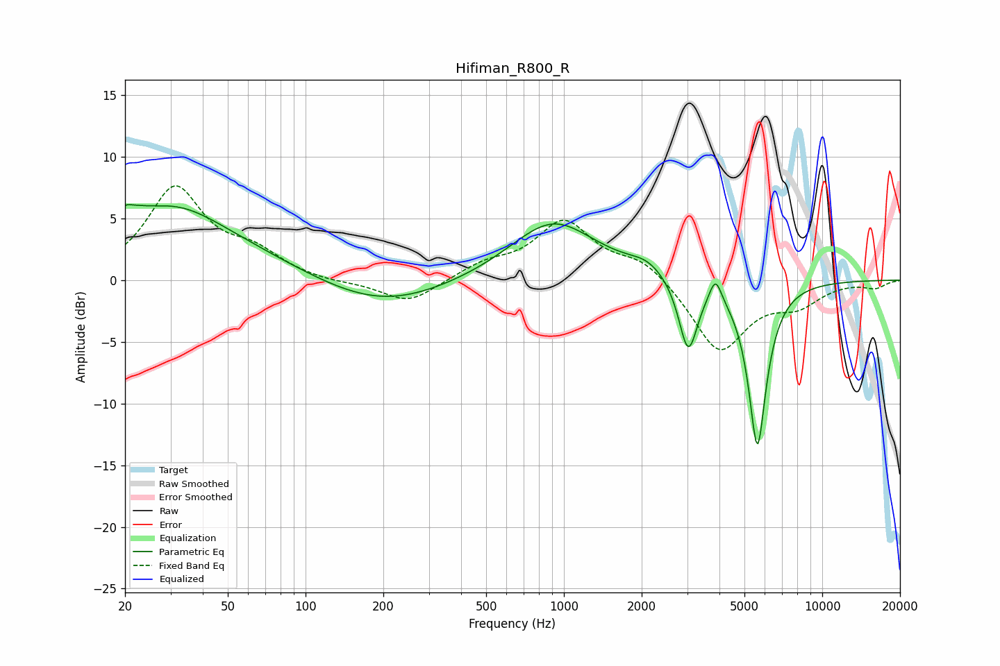

# Hifiman_R800_R
See [usage instructions](https://github.com/jaakkopasanen/AutoEq#usage) for more options and info.

### Parametric EQs
Apply preamp of -6.2 dB when using parametric equalizer.

|   # | Type    |   Fc (Hz) |    Q |   Gain (dB) |
|-----|---------|-----------|------|-------------|
|   1 | Peaking |        21 | 5.47 |         3.5 |
|   2 | Peaking |        21 | 5.89 |        -3   |
|   3 | Peaking |        25 | 0.36 |         5.2 |
|   4 | Peaking |        33 | 1.05 |         1.1 |
|   5 | Peaking |       196 | 0.58 |        -2.3 |
|   6 | Peaking |       908 | 0.85 |         4.8 |
|   7 | Peaking |      2103 | 1.96 |         1   |
|   8 | Peaking |      3028 | 3.91 |        -5.9 |
|   9 | Peaking |      3861 | 5.99 |         2   |
|  10 | Peaking |      5611 | 3.83 |       -13.4 |

### Fixed Band EQs
When using fixed band (also called graphic) equalizer, apply preamp of **-7.7 dB** (if available) and set gains manually with these parameters.

|   # | Type    |   Fc (Hz) |    Q |   Gain (dB) |
|-----|---------|-----------|------|-------------|
|   1 | Peaking |        31 | 1.41 |         7.3 |
|   2 | Peaking |        62 | 1.41 |         1.9 |
|   3 | Peaking |       125 | 1.41 |        -0.3 |
|   4 | Peaking |       250 | 1.41 |        -1.9 |
|   5 | Peaking |       500 | 1.41 |         1.1 |
|   6 | Peaking |      1000 | 1.41 |         4.6 |
|   7 | Peaking |      2000 | 1.41 |         1.6 |
|   8 | Peaking |      4000 | 1.41 |        -5.8 |
|   9 | Peaking |      8000 | 1.41 |        -1.7 |
|  10 | Peaking |     16000 | 1.41 |        -0.6 |

### Graphs

