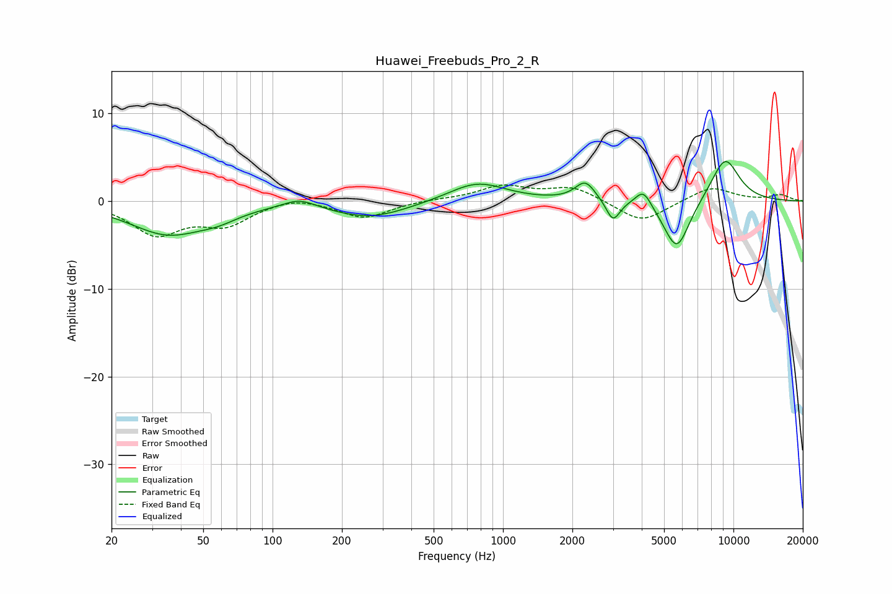

# Huawei_Freebuds_Pro_2_R
See [usage instructions](https://github.com/jaakkopasanen/AutoEq#usage) for more options and info.

### Parametric EQs
Apply preamp of -4.6 dB when using parametric equalizer.

|   # | Type    |   Fc (Hz) |    Q |   Gain (dB) |
|-----|---------|-----------|------|-------------|
|   1 | Peaking |        35 | 0.85 |        -3.6 |
|   2 | Peaking |        58 | 1.62 |        -0.8 |
|   3 | Peaking |       131 | 1.97 |         1.1 |
|   4 | Peaking |       265 | 0.85 |        -1.9 |
|   5 | Peaking |       772 | 1.15 |         2.2 |
|   6 | Peaking |      2277 | 3.25 |         2.2 |
|   7 | Peaking |      3002 | 4.78 |        -2.4 |
|   8 | Peaking |      4069 | 3.99 |         2   |
|   9 | Peaking |      5676 | 2.41 |        -5.8 |
|  10 | Peaking |      9195 | 1.97 |         5.1 |

### Fixed Band EQs
When using fixed band (also called graphic) equalizer, apply preamp of **-1.9 dB** (if available) and set gains manually with these parameters.

|   # | Type    |   Fc (Hz) |    Q |   Gain (dB) |
|-----|---------|-----------|------|-------------|
|   1 | Peaking |        31 | 1.41 |        -3.6 |
|   2 | Peaking |        62 | 1.41 |        -2.4 |
|   3 | Peaking |       125 | 1.41 |         0.7 |
|   4 | Peaking |       250 | 1.41 |        -1.9 |
|   5 | Peaking |       500 | 1.41 |         0.2 |
|   6 | Peaking |      1000 | 1.41 |         1.7 |
|   7 | Peaking |      2000 | 1.41 |         1.6 |
|   8 | Peaking |      4000 | 1.41 |        -2.5 |
|   9 | Peaking |      8000 | 1.41 |         1.7 |
|  10 | Peaking |     16000 | 1.41 |         0.7 |

### Graphs

