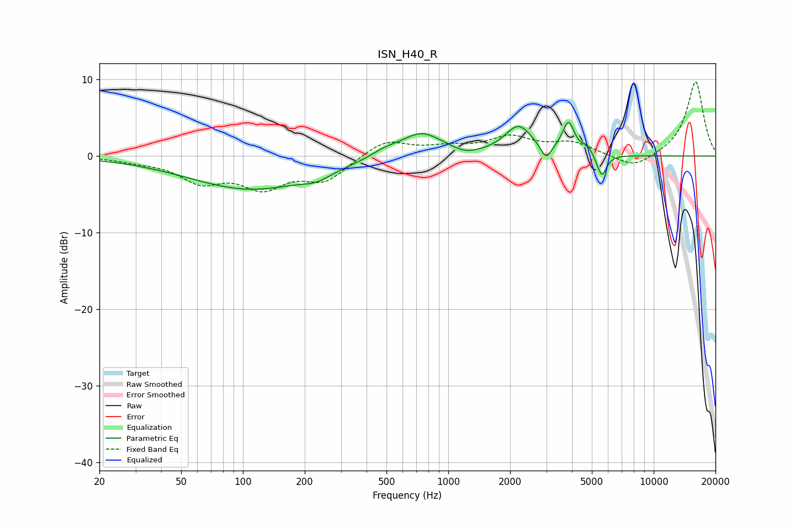

# ISN_H40_R
See [usage instructions](https://github.com/jaakkopasanen/AutoEq#usage) for more options and info.

### Parametric EQs
Apply preamp of -4.5 dB when using parametric equalizer.

|   # | Type    |   Fc (Hz) |    Q |   Gain (dB) |
|-----|---------|-----------|------|-------------|
|   1 | Peaking |       110 | 0.46 |        -4.3 |
|   2 | Peaking |       228 | 2.07 |        -0.9 |
|   3 | Peaking |       486 | 2.07 |         0.8 |
|   4 | Peaking |       739 | 1.37 |         3.2 |
|   5 | Peaking |      1219 | 2.38 |        -0.6 |
|   6 | Peaking |      2198 | 2.14 |         3.8 |
|   7 | Peaking |      2989 | 5.82 |        -1.9 |
|   8 | Peaking |      3846 | 4.76 |         4.1 |
|   9 | Peaking |      4744 | 5.99 |         1   |
|  10 | Peaking |      5592 | 6    |        -2.9 |

### Fixed Band EQs
When using fixed band (also called graphic) equalizer, apply preamp of **-9.8 dB** (if available) and set gains manually with these parameters.

|   # | Type    |   Fc (Hz) |    Q |   Gain (dB) |
|-----|---------|-----------|------|-------------|
|   1 | Peaking |        31 | 1.41 |        -0.5 |
|   2 | Peaking |        62 | 1.41 |        -3   |
|   3 | Peaking |       125 | 1.41 |        -3.6 |
|   4 | Peaking |       250 | 1.41 |        -3   |
|   5 | Peaking |       500 | 1.41 |         2.2 |
|   6 | Peaking |      1000 | 1.41 |         0.9 |
|   7 | Peaking |      2000 | 1.41 |         2.3 |
|   8 | Peaking |      4000 | 1.41 |         1.6 |
|   9 | Peaking |      8000 | 1.41 |        -1.8 |
|  10 | Peaking |     16000 | 1.41 |         9.8 |

### Graphs

