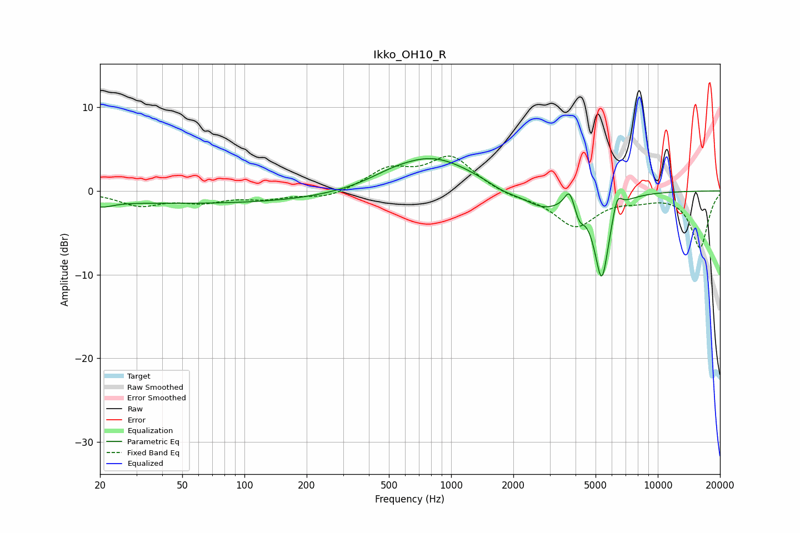

# Ikko_OH10_R
See [usage instructions](https://github.com/jaakkopasanen/AutoEq#usage) for more options and info.

### Parametric EQs
Apply preamp of -4.0 dB when using parametric equalizer.

|   # | Type    |   Fc (Hz) |    Q |   Gain (dB) |
|-----|---------|-----------|------|-------------|
|   1 | Peaking |        20 | 2.55 |        -0.8 |
|   2 | Peaking |        64 | 0.18 |        -1.5 |
|   3 | Peaking |       506 | 1.31 |         0.5 |
|   4 | Peaking |       811 | 0.72 |         4.1 |
|   5 | Peaking |      1778 | 2.03 |        -0.6 |
|   6 | Peaking |      2786 | 1.37 |        -2.1 |
|   7 | Peaking |      3738 | 5.92 |         2.2 |
|   8 | Peaking |      4171 | 6    |        -1.7 |
|   9 | Peaking |      5356 | 3.8  |       -10.3 |
|  10 | Peaking |      6357 | 6    |         2.4 |

### Fixed Band EQs
When using fixed band (also called graphic) equalizer, apply preamp of **-4.3 dB** (if available) and set gains manually with these parameters.

|   # | Type    |   Fc (Hz) |    Q |   Gain (dB) |
|-----|---------|-----------|------|-------------|
|   1 | Peaking |        31 | 1.41 |        -1.6 |
|   2 | Peaking |        62 | 1.41 |        -1.1 |
|   3 | Peaking |       125 | 1.41 |        -0.8 |
|   4 | Peaking |       250 | 1.41 |        -0.9 |
|   5 | Peaking |       500 | 1.41 |         2.4 |
|   6 | Peaking |      1000 | 1.41 |         4   |
|   7 | Peaking |      2000 | 1.41 |        -0.6 |
|   8 | Peaking |      4000 | 1.41 |        -4.1 |
|   9 | Peaking |      8000 | 1.41 |        -0.7 |
|  10 | Peaking |     16000 | 1.41 |        -6.7 |

### Graphs

