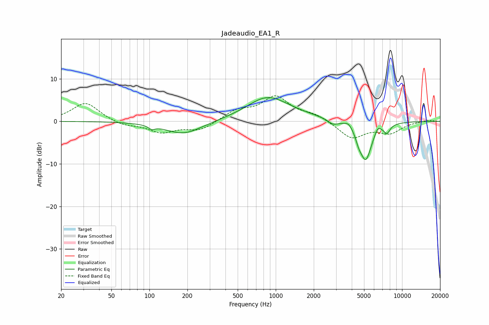

# Jadeaudio_EA1_R
See [usage instructions](https://github.com/jaakkopasanen/AutoEq#usage) for more options and info.

### Parametric EQs
Apply preamp of -5.7 dB when using parametric equalizer.

|   # | Type    |   Fc (Hz) |    Q |   Gain (dB) |
|-----|---------|-----------|------|-------------|
|   1 | Peaking |       104 | 5.98 |        -0.8 |
|   2 | Peaking |       186 | 0.98 |        -3.1 |
|   3 | Peaking |       856 | 0.86 |         5.3 |
|   4 | Peaking |      1432 | 0.62 |         0.6 |
|   5 | Peaking |      2829 | 3.6  |        -1.1 |
|   6 | Peaking |      3776 | 4.63 |         1.1 |
|   7 | Peaking |      4543 | 6    |        -1.6 |
|   8 | Peaking |      5154 | 2.85 |        -9   |
|   9 | Peaking |      6431 | 6    |         1.5 |
|  10 | Peaking |      7599 | 5.36 |        -1.9 |

### Fixed Band EQs
When using fixed band (also called graphic) equalizer, apply preamp of **-6.1 dB** (if available) and set gains manually with these parameters.

|   # | Type    |   Fc (Hz) |    Q |   Gain (dB) |
|-----|---------|-----------|------|-------------|
|   1 | Peaking |        31 | 1.41 |         4.5 |
|   2 | Peaking |        62 | 1.41 |        -1   |
|   3 | Peaking |       125 | 1.41 |        -2.5 |
|   4 | Peaking |       250 | 1.41 |        -2.1 |
|   5 | Peaking |       500 | 1.41 |         2.4 |
|   6 | Peaking |      1000 | 1.41 |         5.5 |
|   7 | Peaking |      2000 | 1.41 |         1.5 |
|   8 | Peaking |      4000 | 1.41 |        -3.9 |
|   9 | Peaking |      8000 | 1.41 |        -2.5 |
|  10 | Peaking |     16000 | 1.41 |         0.4 |

### Graphs

