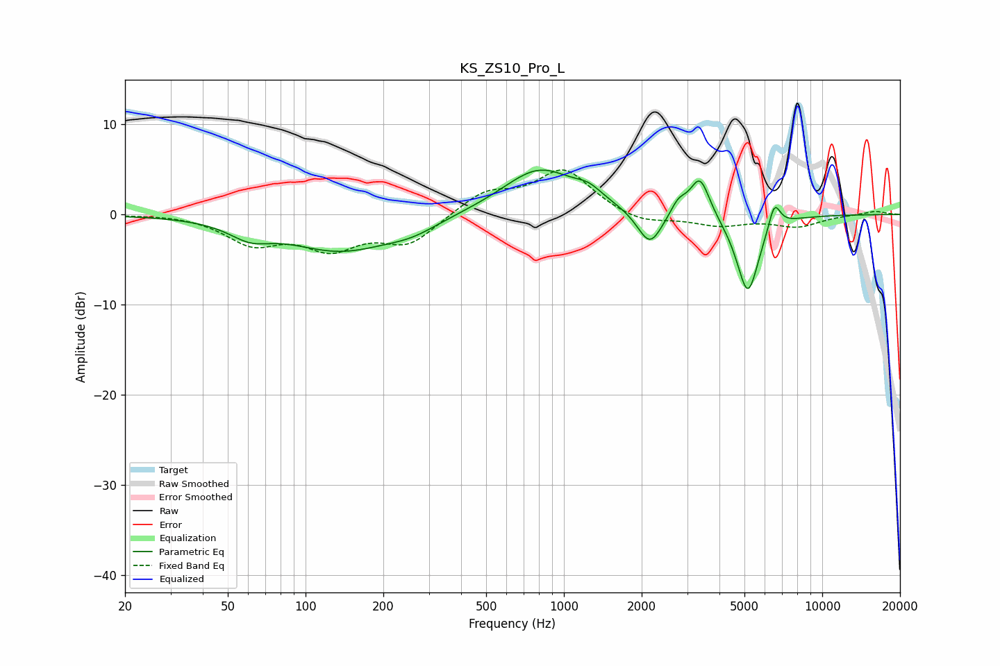

# KS_ZS10_Pro_L
See [usage instructions](https://github.com/jaakkopasanen/AutoEq#usage) for more options and info.

### Parametric EQs
Apply preamp of -5.0 dB when using parametric equalizer.

|   # | Type    |   Fc (Hz) |    Q |   Gain (dB) |
|-----|---------|-----------|------|-------------|
|   1 | Peaking |        61 | 1.77 |        -1.6 |
|   2 | Peaking |       136 | 0.69 |        -3.9 |
|   3 | Peaking |       258 | 1.36 |        -1.1 |
|   4 | Peaking |       805 | 0.98 |         5.1 |
|   5 | Peaking |      1248 | 2.71 |         1.1 |
|   6 | Peaking |      2152 | 2.93 |        -4   |
|   7 | Peaking |      2775 | 4.58 |         1.5 |
|   8 | Peaking |      3362 | 3.7  |         4.5 |
|   9 | Peaking |      5152 | 3.11 |        -8.9 |
|  10 | Peaking |      6528 | 5.92 |         3   |

### Fixed Band EQs
When using fixed band (also called graphic) equalizer, apply preamp of **-5.0 dB** (if available) and set gains manually with these parameters.

|   # | Type    |   Fc (Hz) |    Q |   Gain (dB) |
|-----|---------|-----------|------|-------------|
|   1 | Peaking |        31 | 1.41 |         0.1 |
|   2 | Peaking |        62 | 1.41 |        -3   |
|   3 | Peaking |       125 | 1.41 |        -3.3 |
|   4 | Peaking |       250 | 1.41 |        -3.1 |
|   5 | Peaking |       500 | 1.41 |         2.4 |
|   6 | Peaking |      1000 | 1.41 |         4.9 |
|   7 | Peaking |      2000 | 1.41 |        -1.1 |
|   8 | Peaking |      4000 | 1.41 |        -1.1 |
|   9 | Peaking |      8000 | 1.41 |        -1.3 |
|  10 | Peaking |     16000 | 1.41 |         0.4 |

### Graphs

