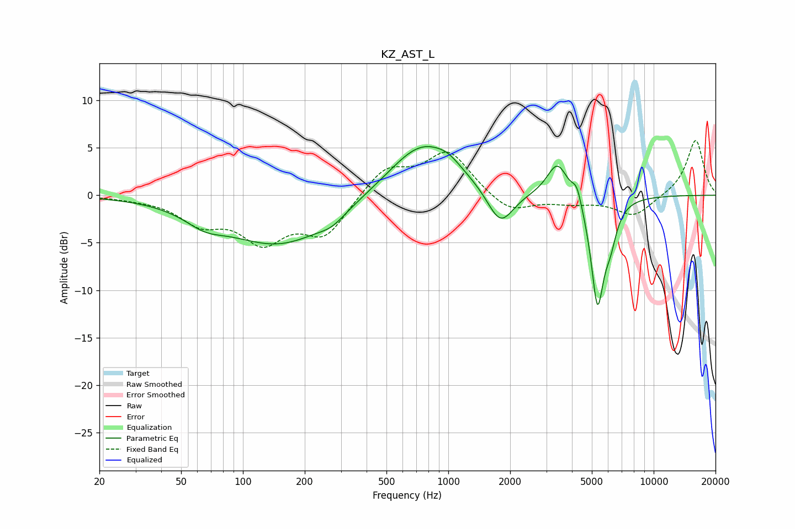

# KZ_AST_L
See [usage instructions](https://github.com/jaakkopasanen/AutoEq#usage) for more options and info.

### Parametric EQs
Apply preamp of -5.2 dB when using parametric equalizer.

|   # | Type    |   Fc (Hz) |    Q |   Gain (dB) |
|-----|---------|-----------|------|-------------|
|   1 | Peaking |        65 | 1.49 |        -1.4 |
|   2 | Peaking |       151 | 0.54 |        -5.2 |
|   3 | Peaking |       271 | 2.29 |        -0.8 |
|   4 | Peaking |       749 | 0.84 |         5.8 |
|   5 | Peaking |       999 | 2.49 |         0.7 |
|   6 | Peaking |      1794 | 2.16 |        -4   |
|   7 | Peaking |      3403 | 2.8  |         3.7 |
|   8 | Peaking |      4229 | 6    |         1.8 |
|   9 | Peaking |      5325 | 4.3  |       -11.2 |
|  10 | Peaking |      6152 | 4.36 |        -2.9 |

### Fixed Band EQs
When using fixed band (also called graphic) equalizer, apply preamp of **-5.9 dB** (if available) and set gains manually with these parameters.

|   # | Type    |   Fc (Hz) |    Q |   Gain (dB) |
|-----|---------|-----------|------|-------------|
|   1 | Peaking |        31 | 1.41 |        -0.2 |
|   2 | Peaking |        62 | 1.41 |        -2.6 |
|   3 | Peaking |       125 | 1.41 |        -4.4 |
|   4 | Peaking |       250 | 1.41 |        -4   |
|   5 | Peaking |       500 | 1.41 |         2.9 |
|   6 | Peaking |      1000 | 1.41 |         4.5 |
|   7 | Peaking |      2000 | 1.41 |        -1.9 |
|   8 | Peaking |      4000 | 1.41 |        -0.7 |
|   9 | Peaking |      8000 | 1.41 |        -2.2 |
|  10 | Peaking |     16000 | 1.41 |         5.9 |

### Graphs

