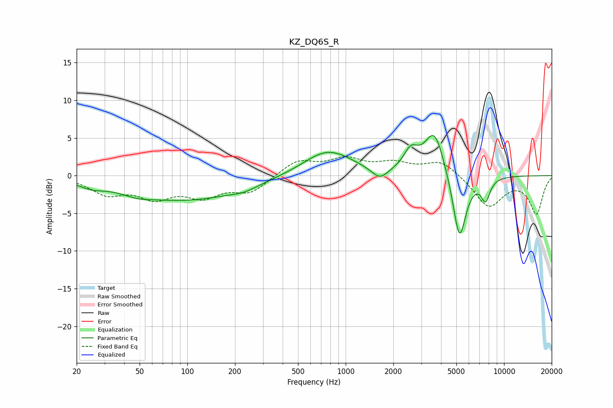

# KZ_DQ6S_R
See [usage instructions](https://github.com/jaakkopasanen/AutoEq#usage) for more options and info.

### Parametric EQs
Apply preamp of -5.4 dB when using parametric equalizer.

|   # | Type    |   Fc (Hz) |    Q |   Gain (dB) |
|-----|---------|-----------|------|-------------|
|   1 | Peaking |        25 | 1.85 |        -0.8 |
|   2 | Peaking |        48 | 1.51 |        -0.6 |
|   3 | Peaking |        97 | 0.39 |        -3.2 |
|   4 | Peaking |       229 | 1.73 |        -0.5 |
|   5 | Peaking |       772 | 0.92 |         3.4 |
|   6 | Peaking |      1640 | 2.75 |        -1.5 |
|   7 | Peaking |      2576 | 3.19 |         2.5 |
|   8 | Peaking |      3637 | 2.21 |         6.1 |
|   9 | Peaking |      5230 | 3.24 |        -9.2 |
|  10 | Peaking |      7649 | 4.75 |        -2.8 |

### Fixed Band EQs
When using fixed band (also called graphic) equalizer, apply preamp of **-2.6 dB** (if available) and set gains manually with these parameters.

|   # | Type    |   Fc (Hz) |    Q |   Gain (dB) |
|-----|---------|-----------|------|-------------|
|   1 | Peaking |        31 | 1.41 |        -2.2 |
|   2 | Peaking |        62 | 1.41 |        -2.6 |
|   3 | Peaking |       125 | 1.41 |        -2.4 |
|   4 | Peaking |       250 | 1.41 |        -2.1 |
|   5 | Peaking |       500 | 1.41 |         2   |
|   6 | Peaking |      1000 | 1.41 |         2   |
|   7 | Peaking |      2000 | 1.41 |         1.4 |
|   8 | Peaking |      4000 | 1.41 |         2   |
|   9 | Peaking |      8000 | 1.41 |        -4.1 |
|  10 | Peaking |     16000 | 1.41 |        -5   |

### Graphs

