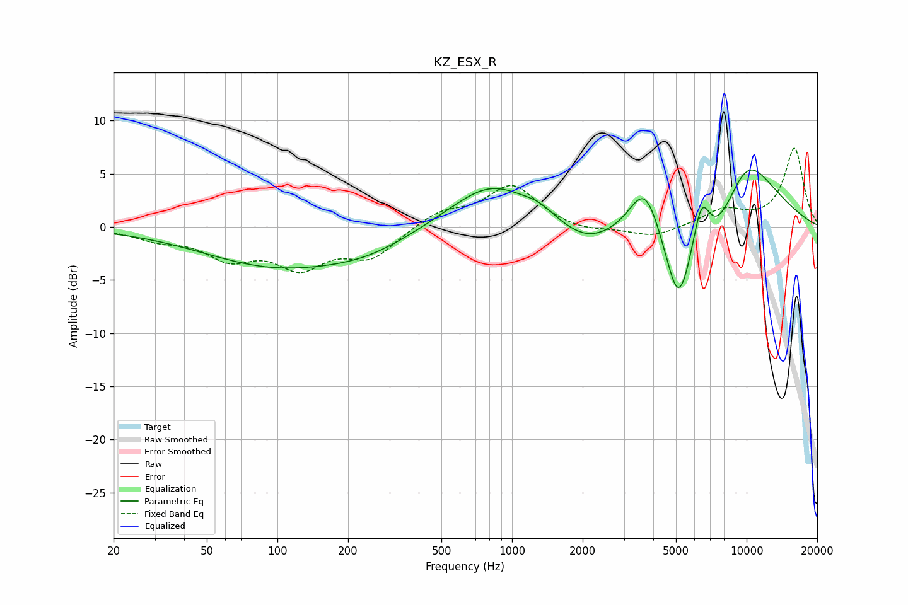

# KZ_ESX_R
See [usage instructions](https://github.com/jaakkopasanen/AutoEq#usage) for more options and info.

### Parametric EQs
Apply preamp of -5.5 dB when using parametric equalizer.

|   # | Type    |   Fc (Hz) |    Q |   Gain (dB) |
|-----|---------|-----------|------|-------------|
|   1 | Peaking |        97 | 0.45 |        -3.5 |
|   2 | Peaking |       242 | 0.73 |        -1.4 |
|   3 | Peaking |       820 | 0.81 |         4.3 |
|   4 | Peaking |      1301 | 2.41 |         0.7 |
|   5 | Peaking |      2051 | 1.31 |        -1.4 |
|   6 | Peaking |      3699 | 1.89 |         6.3 |
|   7 | Peaking |      5118 | 2.74 |        -5.8 |
|   8 | Peaking |      6416 | 3.34 |         5.8 |
|   9 | Peaking |      6897 | 0.65 |        -9.9 |
|  10 | Peaking |      9738 | 0.78 |        11.7 |

### Fixed Band EQs
When using fixed band (also called graphic) equalizer, apply preamp of **-7.5 dB** (if available) and set gains manually with these parameters.

|   # | Type    |   Fc (Hz) |    Q |   Gain (dB) |
|-----|---------|-----------|------|-------------|
|   1 | Peaking |        31 | 1.41 |        -1   |
|   2 | Peaking |        62 | 1.41 |        -2.6 |
|   3 | Peaking |       125 | 1.41 |        -3.4 |
|   4 | Peaking |       250 | 1.41 |        -2.7 |
|   5 | Peaking |       500 | 1.41 |         1.4 |
|   6 | Peaking |      1000 | 1.41 |         3.9 |
|   7 | Peaking |      2000 | 1.41 |        -0.5 |
|   8 | Peaking |      4000 | 1.41 |        -1   |
|   9 | Peaking |      8000 | 1.41 |         1.5 |
|  10 | Peaking |     16000 | 1.41 |         7.4 |

### Graphs

