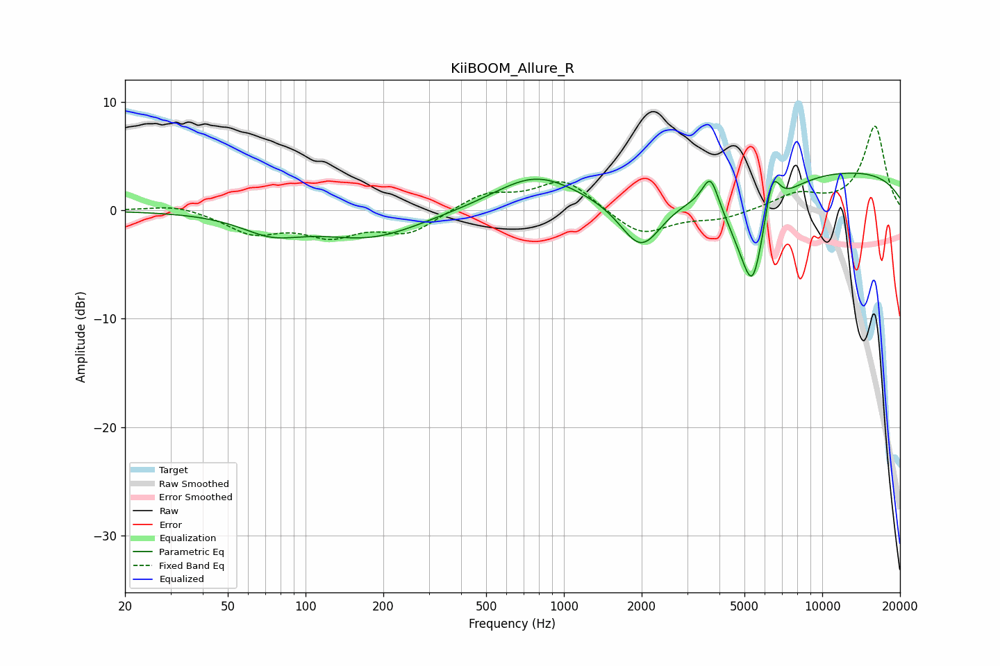

# KiiBOOM_Allure_R
See [usage instructions](https://github.com/jaakkopasanen/AutoEq#usage) for more options and info.

### Parametric EQs
Apply preamp of -3.5 dB when using parametric equalizer.

|   # | Type    |   Fc (Hz) |    Q |   Gain (dB) |
|-----|---------|-----------|------|-------------|
|   1 | Peaking |        74 | 1.2  |        -1.7 |
|   2 | Peaking |       178 | 0.71 |        -2.5 |
|   3 | Peaking |       771 | 0.89 |         3   |
|   4 | Peaking |      1994 | 1.66 |        -5.2 |
|   5 | Peaking |      3694 | 4.56 |         3   |
|   6 | Peaking |      5256 | 1.75 |        -7.5 |
|   7 | Peaking |      5390 | 4.45 |        -2.9 |
|   8 | Peaking |      6348 | 5.44 |         3.3 |
|   9 | Peaking |      6667 | 5.08 |         1   |
|  10 | Peaking |      9244 | 0.18 |         3.9 |

### Fixed Band EQs
When using fixed band (also called graphic) equalizer, apply preamp of **-7.9 dB** (if available) and set gains manually with these parameters.

|   # | Type    |   Fc (Hz) |    Q |   Gain (dB) |
|-----|---------|-----------|------|-------------|
|   1 | Peaking |        31 | 1.41 |         0.6 |
|   2 | Peaking |        62 | 1.41 |        -2   |
|   3 | Peaking |       125 | 1.41 |        -2.1 |
|   4 | Peaking |       250 | 1.41 |        -2   |
|   5 | Peaking |       500 | 1.41 |         1.5 |
|   6 | Peaking |      1000 | 1.41 |         2.8 |
|   7 | Peaking |      2000 | 1.41 |        -2.4 |
|   8 | Peaking |      4000 | 1.41 |        -0.8 |
|   9 | Peaking |      8000 | 1.41 |         1.4 |
|  10 | Peaking |     16000 | 1.41 |         7.7 |

### Graphs

