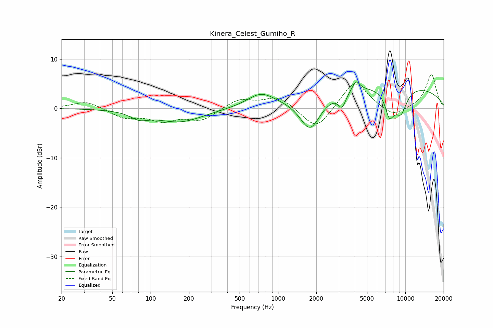

# Kinera_Celest_Gumiho_R
See [usage instructions](https://github.com/jaakkopasanen/AutoEq#usage) for more options and info.

### Parametric EQs
Apply preamp of -5.5 dB when using parametric equalizer.

|   # | Type    |   Fc (Hz) |    Q |   Gain (dB) |
|-----|---------|-----------|------|-------------|
|   1 | Peaking |        82 | 2.05 |        -1.4 |
|   2 | Peaking |       169 | 0.77 |        -2.7 |
|   3 | Peaking |       733 | 1.36 |         2.6 |
|   4 | Peaking |      1787 | 1.67 |        -7.2 |
|   5 | Peaking |      3183 | 4.78 |        -2.8 |
|   6 | Peaking |      4097 | 4.91 |         2.1 |
|   7 | Peaking |      6864 | 0.18 |         4.9 |
|   8 | Peaking |      7623 | 3.76 |        -6.8 |
|   9 | Peaking |      7774 | 5.98 |         1.7 |
|  10 | Peaking |      9257 | 2.67 |        -4.6 |

### Fixed Band EQs
When using fixed band (also called graphic) equalizer, apply preamp of **-6.9 dB** (if available) and set gains manually with these parameters.

|   # | Type    |   Fc (Hz) |    Q |   Gain (dB) |
|-----|---------|-----------|------|-------------|
|   1 | Peaking |        31 | 1.41 |         1.6 |
|   2 | Peaking |        62 | 1.41 |        -1.8 |
|   3 | Peaking |       125 | 1.41 |        -2.2 |
|   4 | Peaking |       250 | 1.41 |        -2.3 |
|   5 | Peaking |       500 | 1.41 |         1.9 |
|   6 | Peaking |      1000 | 1.41 |         2.4 |
|   7 | Peaking |      2000 | 1.41 |        -4.6 |
|   8 | Peaking |      4000 | 1.41 |         5.8 |
|   9 | Peaking |      8000 | 1.41 |        -2   |
|  10 | Peaking |     16000 | 1.41 |         6.9 |

### Graphs

