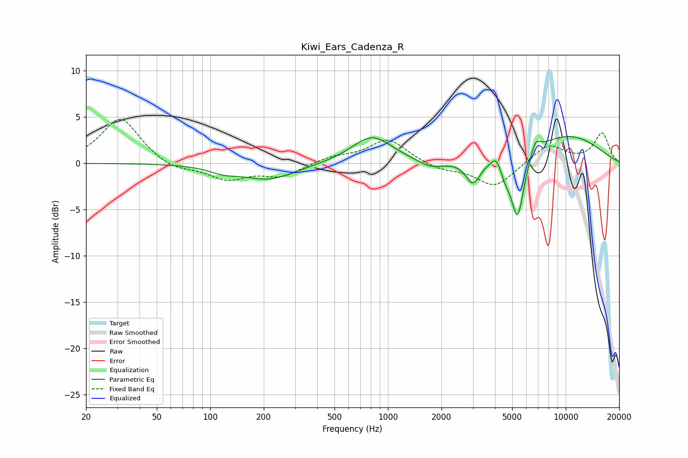

# Kiwi_Ears_Cadenza_R
See [usage instructions](https://github.com/jaakkopasanen/AutoEq#usage) for more options and info.

### Parametric EQs
Apply preamp of -3.0 dB when using parametric equalizer.

|   # | Type    |   Fc (Hz) |    Q |   Gain (dB) |
|-----|---------|-----------|------|-------------|
|   1 | Peaking |       118 | 1.82 |        -0.6 |
|   2 | Peaking |       213 | 0.93 |        -1.7 |
|   3 | Peaking |       813 | 1.25 |         2.9 |
|   4 | Peaking |      1742 | 1.94 |        -0.8 |
|   5 | Peaking |      3010 | 3.52 |        -2.5 |
|   6 | Peaking |      4045 | 5.55 |         1   |
|   7 | Peaking |      4581 | 6    |        -1.1 |
|   8 | Peaking |      5358 | 3.74 |        -7.2 |
|   9 | Peaking |      6765 | 5.14 |         1.4 |
|  10 | Peaking |     10000 | 0.53 |         3   |

### Fixed Band EQs
When using fixed band (also called graphic) equalizer, apply preamp of **-4.8 dB** (if available) and set gains manually with these parameters.

|   # | Type    |   Fc (Hz) |    Q |   Gain (dB) |
|-----|---------|-----------|------|-------------|
|   1 | Peaking |        31 | 1.41 |         5   |
|   2 | Peaking |        62 | 1.41 |        -0.9 |
|   3 | Peaking |       125 | 1.41 |        -1.7 |
|   4 | Peaking |       250 | 1.41 |        -1.4 |
|   5 | Peaking |       500 | 1.41 |         0.7 |
|   6 | Peaking |      1000 | 1.41 |         2.6 |
|   7 | Peaking |      2000 | 1.41 |        -0.7 |
|   8 | Peaking |      4000 | 1.41 |        -2.6 |
|   9 | Peaking |      8000 | 1.41 |         2   |
|  10 | Peaking |     16000 | 1.41 |         3.2 |

### Graphs

