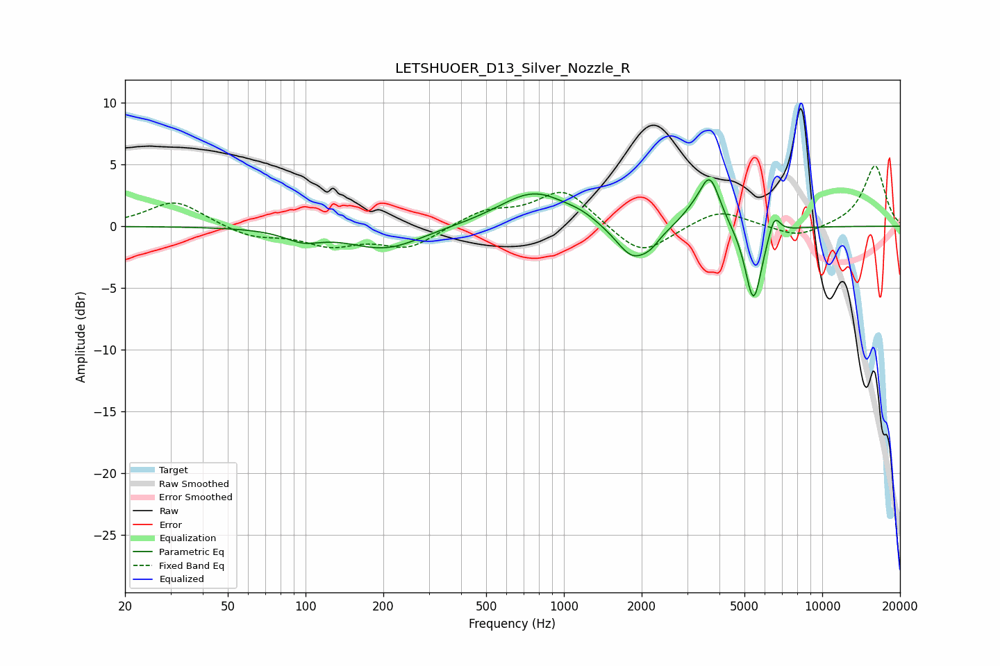

# LETSHUOER_D13_Silver_Nozzle_R
See [usage instructions](https://github.com/jaakkopasanen/AutoEq#usage) for more options and info.

### Parametric EQs
Apply preamp of -3.9 dB when using parametric equalizer.

|   # | Type    |   Fc (Hz) |    Q |   Gain (dB) |
|-----|---------|-----------|------|-------------|
|   1 | Peaking |        98 | 1.99 |        -0.9 |
|   2 | Peaking |       203 | 0.99 |        -1.8 |
|   3 | Peaking |       768 | 1.03 |         2.9 |
|   4 | Peaking |      1166 | 2.53 |         0.3 |
|   5 | Peaking |      1852 | 2.08 |        -2.9 |
|   6 | Peaking |      2173 | 4.2  |        -0.6 |
|   7 | Peaking |      3132 | 2.81 |         0.8 |
|   8 | Peaking |      3672 | 3.5  |         4   |
|   9 | Peaking |      5418 | 4.23 |        -6.3 |
|  10 | Peaking |      6519 | 6    |         1.8 |

### Fixed Band EQs
When using fixed band (also called graphic) equalizer, apply preamp of **-5.0 dB** (if available) and set gains manually with these parameters.

|   # | Type    |   Fc (Hz) |    Q |   Gain (dB) |
|-----|---------|-----------|------|-------------|
|   1 | Peaking |        31 | 1.41 |         2.1 |
|   2 | Peaking |        62 | 1.41 |        -0.9 |
|   3 | Peaking |       125 | 1.41 |        -1.4 |
|   4 | Peaking |       250 | 1.41 |        -1.7 |
|   5 | Peaking |       500 | 1.41 |         1.2 |
|   6 | Peaking |      1000 | 1.41 |         3   |
|   7 | Peaking |      2000 | 1.41 |        -2.5 |
|   8 | Peaking |      4000 | 1.41 |         1.4 |
|   9 | Peaking |      8000 | 1.41 |        -1   |
|  10 | Peaking |     16000 | 1.41 |         4.9 |

### Graphs

