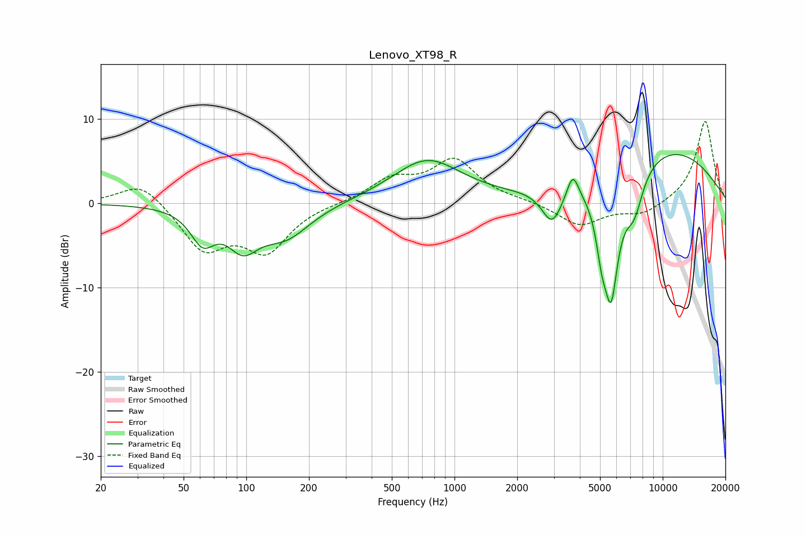

# Lenovo_XT98_R
See [usage instructions](https://github.com/jaakkopasanen/AutoEq#usage) for more options and info.

### Parametric EQs
Apply preamp of -5.9 dB when using parametric equalizer.

|   # | Type    |   Fc (Hz) |    Q |   Gain (dB) |
|-----|---------|-----------|------|-------------|
|   1 | Peaking |        62 | 2.47 |        -3.8 |
|   2 | Peaking |        96 | 1.9  |        -4.1 |
|   3 | Peaking |       154 | 1.16 |        -3.7 |
|   4 | Peaking |       738 | 0.85 |         5.1 |
|   5 | Peaking |      2944 | 2.87 |        -4.1 |
|   6 | Peaking |      3699 | 5.04 |         3   |
|   7 | Peaking |      5089 | 5.39 |        -4.1 |
|   8 | Peaking |      5647 | 3.47 |       -14   |
|   9 | Peaking |      7292 | 3    |        -4.6 |
|  10 | Peaking |      9976 | 0.38 |         6.6 |

### Fixed Band EQs
When using fixed band (also called graphic) equalizer, apply preamp of **-9.8 dB** (if available) and set gains manually with these parameters.

|   # | Type    |   Fc (Hz) |    Q |   Gain (dB) |
|-----|---------|-----------|------|-------------|
|   1 | Peaking |        31 | 1.41 |         2.8 |
|   2 | Peaking |        62 | 1.41 |        -5.3 |
|   3 | Peaking |       125 | 1.41 |        -5.3 |
|   4 | Peaking |       250 | 1.41 |         0   |
|   5 | Peaking |       500 | 1.41 |         2.6 |
|   6 | Peaking |      1000 | 1.41 |         4.9 |
|   7 | Peaking |      2000 | 1.41 |         0.2 |
|   8 | Peaking |      4000 | 1.41 |        -2.7 |
|   9 | Peaking |      8000 | 1.41 |        -1.3 |
|  10 | Peaking |     16000 | 1.41 |         9.9 |

### Graphs

