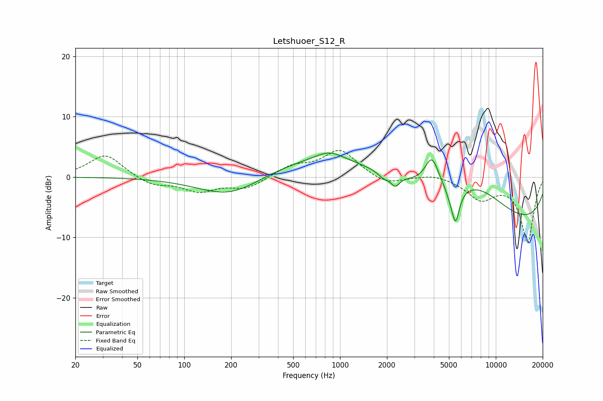

# Letshuoer_S12_R
See [usage instructions](https://github.com/jaakkopasanen/AutoEq#usage) for more options and info.

### Parametric EQs
Apply preamp of -4.1 dB when using parametric equalizer.

|   # | Type    |   Fc (Hz) |    Q |   Gain (dB) |
|-----|---------|-----------|------|-------------|
|   1 | Peaking |       200 | 0.68 |        -3.8 |
|   2 | Peaking |       855 | 1.6  |         1.6 |
|   3 | Peaking |      1346 | 0.2  |         4.1 |
|   4 | Peaking |      1900 | 3.79 |        -0.9 |
|   5 | Peaking |      2258 | 5.01 |        -1.7 |
|   6 | Peaking |      3885 | 3.22 |         4.7 |
|   7 | Peaking |      4978 | 5.9  |        -0.6 |
|   8 | Peaking |      5507 | 5.13 |        -6.1 |
|   9 | Peaking |      7676 | 0.69 |         4.6 |
|  10 | Peaking |     10000 | 0.18 |        -8.3 |

### Fixed Band EQs
When using fixed band (also called graphic) equalizer, apply preamp of **-4.5 dB** (if available) and set gains manually with these parameters.

|   # | Type    |   Fc (Hz) |    Q |   Gain (dB) |
|-----|---------|-----------|------|-------------|
|   1 | Peaking |        31 | 1.41 |         3.8 |
|   2 | Peaking |        62 | 1.41 |        -1.4 |
|   3 | Peaking |       125 | 1.41 |        -2.2 |
|   4 | Peaking |       250 | 1.41 |        -1.8 |
|   5 | Peaking |       500 | 1.41 |         1.7 |
|   6 | Peaking |      1000 | 1.41 |         4.4 |
|   7 | Peaking |      2000 | 1.41 |        -1.4 |
|   8 | Peaking |      4000 | 1.41 |         0.6 |
|   9 | Peaking |      8000 | 1.41 |        -3.4 |
|  10 | Peaking |     16000 | 1.41 |       -10.8 |

### Graphs

