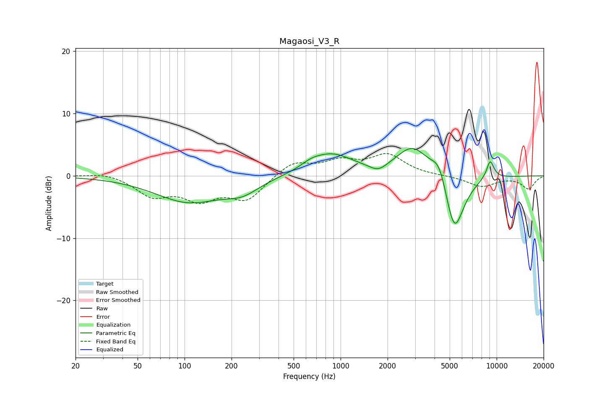

# Magaosi_V3_R
See [usage instructions](https://github.com/jaakkopasanen/AutoEq#usage) for more options and info.

### Parametric EQs
Apply preamp of -4.5 dB when using parametric equalizer.

|   # | Type    |   Fc (Hz) |    Q |   Gain (dB) |
|-----|---------|-----------|------|-------------|
|   1 | Peaking |       106 | 0.65 |        -4.1 |
|   2 | Peaking |       235 | 1.31 |        -1.9 |
|   3 | Peaking |       644 | 2.41 |         0.6 |
|   4 | Peaking |       866 | 0.99 |         3.4 |
|   5 | Peaking |      1743 | 2.59 |        -1.2 |
|   6 | Peaking |      2903 | 1.35 |         4.8 |
|   7 | Peaking |      4296 | 2.78 |         3.6 |
|   8 | Peaking |      5348 | 2.18 |       -10.1 |
|   9 | Peaking |      8791 | 6    |        -1.1 |
|  10 | Peaking |      9010 | 4.86 |         4   |

### Fixed Band EQs
When using fixed band (also called graphic) equalizer, apply preamp of **-3.7 dB** (if available) and set gains manually with these parameters.

|   # | Type    |   Fc (Hz) |    Q |   Gain (dB) |
|-----|---------|-----------|------|-------------|
|   1 | Peaking |        31 | 1.41 |         0.6 |
|   2 | Peaking |        62 | 1.41 |        -3   |
|   3 | Peaking |       125 | 1.41 |        -3.3 |
|   4 | Peaking |       250 | 1.41 |        -3.7 |
|   5 | Peaking |       500 | 1.41 |         2.3 |
|   6 | Peaking |      1000 | 1.41 |         2.1 |
|   7 | Peaking |      2000 | 1.41 |         3.2 |
|   8 | Peaking |      4000 | 1.41 |        -0   |
|   9 | Peaking |      8000 | 1.41 |        -1.7 |
|  10 | Peaking |     16000 | 1.41 |        -2   |

### Graphs

