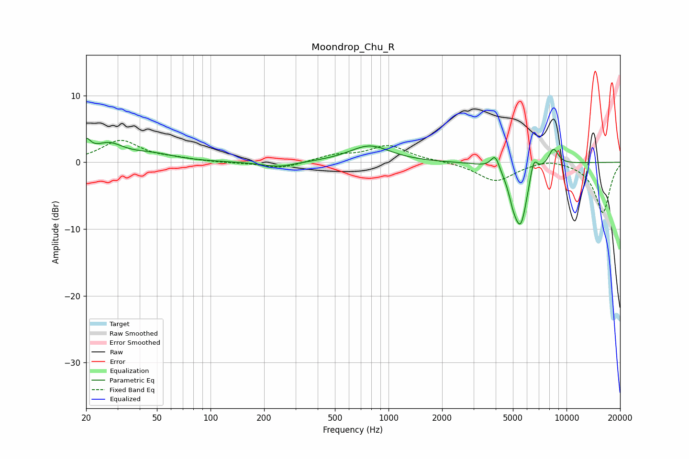

# Moondrop_Chu_R
See [usage instructions](https://github.com/jaakkopasanen/AutoEq#usage) for more options and info.

### Parametric EQs
Apply preamp of -3.7 dB when using parametric equalizer.

|   # | Type    |   Fc (Hz) |    Q |   Gain (dB) |
|-----|---------|-----------|------|-------------|
|   1 | Peaking |        20 | 5.79 |         2.1 |
|   2 | Peaking |        27 | 1.66 |         2.4 |
|   3 | Peaking |        47 | 1.11 |         1   |
|   4 | Peaking |       241 | 1.51 |        -0.8 |
|   5 | Peaking |       784 | 1.24 |         2.5 |
|   6 | Peaking |      3974 | 5.83 |         2.3 |
|   7 | Peaking |      5005 | 5.98 |        -1.6 |
|   8 | Peaking |      5518 | 3.24 |        -9.4 |
|   9 | Peaking |      6528 | 5.9  |         3.3 |
|  10 | Peaking |      8440 | 4.58 |         2.6 |

### Fixed Band EQs
When using fixed band (also called graphic) equalizer, apply preamp of **-3.4 dB** (if available) and set gains manually with these parameters.

|   # | Type    |   Fc (Hz) |    Q |   Gain (dB) |
|-----|---------|-----------|------|-------------|
|   1 | Peaking |        31 | 1.41 |         3.2 |
|   2 | Peaking |        62 | 1.41 |         0.4 |
|   3 | Peaking |       125 | 1.41 |        -0.1 |
|   4 | Peaking |       250 | 1.41 |        -1   |
|   5 | Peaking |       500 | 1.41 |         1   |
|   6 | Peaking |      1000 | 1.41 |         2.4 |
|   7 | Peaking |      2000 | 1.41 |         0.1 |
|   8 | Peaking |      4000 | 1.41 |        -2.8 |
|   9 | Peaking |      8000 | 1.41 |         0.7 |
|  10 | Peaking |     16000 | 1.41 |        -7.6 |

### Graphs

