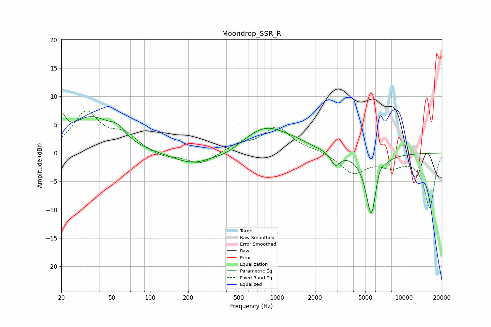

# Moondrop_SSR_R
See [usage instructions](https://github.com/jaakkopasanen/AutoEq#usage) for more options and info.

### Parametric EQs
Apply preamp of -7.2 dB when using parametric equalizer.

|   # | Type    |   Fc (Hz) |    Q |   Gain (dB) |
|-----|---------|-----------|------|-------------|
|   1 | Peaking |        20 | 4.4  |         3.9 |
|   2 | Peaking |        34 | 0.87 |         6   |
|   3 | Peaking |        55 | 2.13 |         1.9 |
|   4 | Peaking |       222 | 0.86 |        -2.2 |
|   5 | Peaking |       408 | 1.64 |        -0.7 |
|   6 | Peaking |       814 | 0.81 |         4.5 |
|   7 | Peaking |      1420 | 1.24 |         0.7 |
|   8 | Peaking |      2898 | 4.04 |        -2.3 |
|   9 | Peaking |      5555 | 3.19 |       -11.2 |
|  10 | Peaking |      6413 | 4.47 |         1.6 |

### Fixed Band EQs
When using fixed band (also called graphic) equalizer, apply preamp of **-7.5 dB** (if available) and set gains manually with these parameters.

|   # | Type    |   Fc (Hz) |    Q |   Gain (dB) |
|-----|---------|-----------|------|-------------|
|   1 | Peaking |        31 | 1.41 |         6.9 |
|   2 | Peaking |        62 | 1.41 |         2.9 |
|   3 | Peaking |       125 | 1.41 |        -0.9 |
|   4 | Peaking |       250 | 1.41 |        -2.1 |
|   5 | Peaking |       500 | 1.41 |         1.4 |
|   6 | Peaking |      1000 | 1.41 |         4.4 |
|   7 | Peaking |      2000 | 1.41 |         0.5 |
|   8 | Peaking |      4000 | 1.41 |        -3.5 |
|   9 | Peaking |      8000 | 1.41 |        -1.9 |
|  10 | Peaking |     16000 | 1.41 |        -9.6 |

### Graphs

