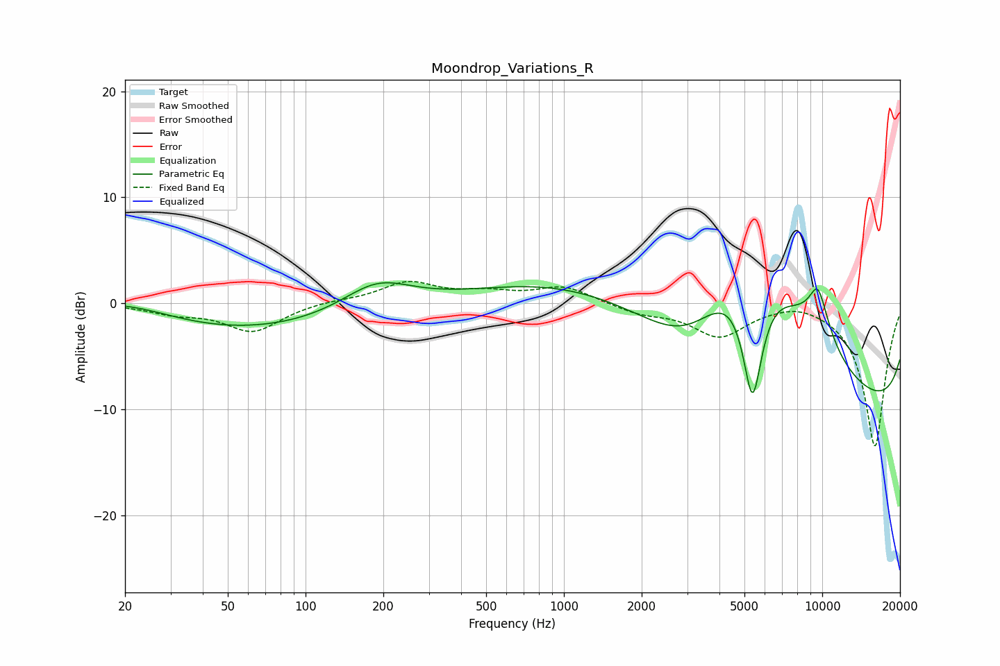

# Moondrop_Variations_R
See [usage instructions](https://github.com/jaakkopasanen/AutoEq#usage) for more options and info.

### Parametric EQs
Apply preamp of -2.0 dB when using parametric equalizer.

|   # | Type    |   Fc (Hz) |    Q |   Gain (dB) |
|-----|---------|-----------|------|-------------|
|   1 | Peaking |        21 | 0.8  |         1.3 |
|   2 | Peaking |        55 | 0.35 |        -2.6 |
|   3 | Peaking |       189 | 1.06 |         2.7 |
|   4 | Peaking |      3102 | 0.58 |       -11.2 |
|   5 | Peaking |      4436 | 0.28 |        17.9 |
|   6 | Peaking |      5289 | 0.73 |         8   |
|   7 | Peaking |      5372 | 3.17 |       -12.6 |
|   8 | Peaking |      9609 | 4.54 |         1.8 |
|   9 | Peaking |      9684 | 2.2  |         3.3 |
|  10 | Peaking |     10000 | 0.18 |       -16.5 |

### Fixed Band EQs
When using fixed band (also called graphic) equalizer, apply preamp of **-2.2 dB** (if available) and set gains manually with these parameters.

|   # | Type    |   Fc (Hz) |    Q |   Gain (dB) |
|-----|---------|-----------|------|-------------|
|   1 | Peaking |        31 | 1.41 |        -0.8 |
|   2 | Peaking |        62 | 1.41 |        -2.6 |
|   3 | Peaking |       125 | 1.41 |         0.2 |
|   4 | Peaking |       250 | 1.41 |         1.9 |
|   5 | Peaking |       500 | 1.41 |         0.8 |
|   6 | Peaking |      1000 | 1.41 |         1.6 |
|   7 | Peaking |      2000 | 1.41 |        -0.9 |
|   8 | Peaking |      4000 | 1.41 |        -3   |
|   9 | Peaking |      8000 | 1.41 |         0.6 |
|  10 | Peaking |     16000 | 1.41 |       -13.6 |

### Graphs

