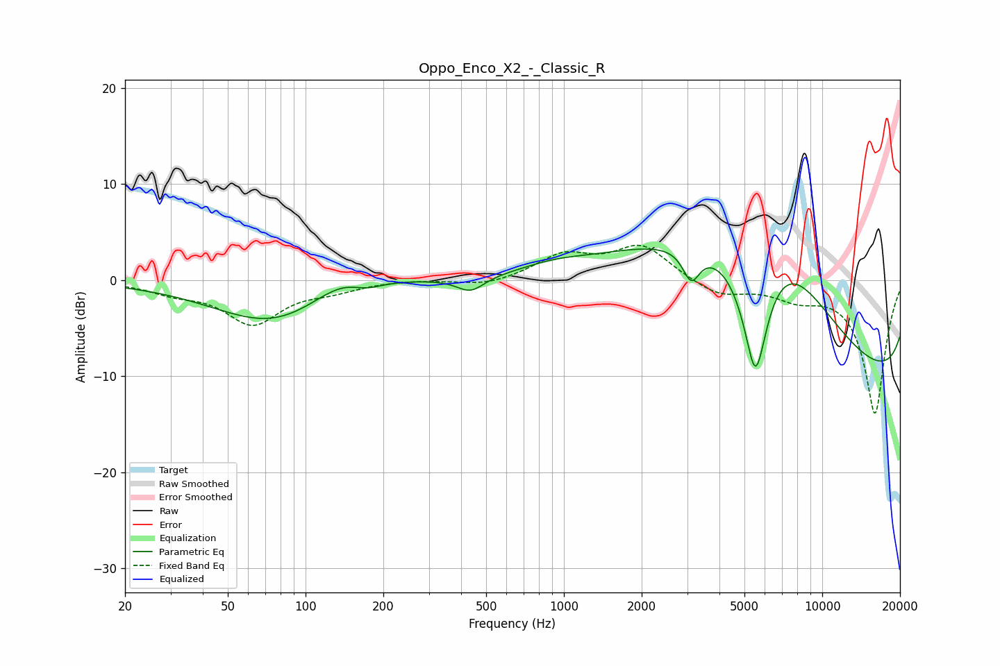

# Oppo_Enco_X2_-_Classic_R
See [usage instructions](https://github.com/jaakkopasanen/AutoEq#usage) for more options and info.

### Parametric EQs
Apply preamp of -3.3 dB when using parametric equalizer.

|   # | Type    |   Fc (Hz) |    Q |   Gain (dB) |
|-----|---------|-----------|------|-------------|
|   1 | Peaking |        76 | 0.61 |        -4.7 |
|   2 | Peaking |       148 | 1.05 |         2.9 |
|   3 | Peaking |       171 | 1.96 |        -1.4 |
|   4 | Peaking |       435 | 2.67 |        -1.5 |
|   5 | Peaking |       908 | 1.21 |         0.6 |
|   6 | Peaking |      3110 | 4.29 |        -3.3 |
|   7 | Peaking |      3367 | 0.3  |         5.4 |
|   8 | Peaking |      5517 | 2.37 |       -15.5 |
|   9 | Peaking |      6490 | 0.38 |        18.8 |
|  10 | Peaking |     10000 | 0.18 |       -18.6 |

### Fixed Band EQs
When using fixed band (also called graphic) equalizer, apply preamp of **-3.7 dB** (if available) and set gains manually with these parameters.

|   # | Type    |   Fc (Hz) |    Q |   Gain (dB) |
|-----|---------|-----------|------|-------------|
|   1 | Peaking |        31 | 1.41 |        -1   |
|   2 | Peaking |        62 | 1.41 |        -4.4 |
|   3 | Peaking |       125 | 1.41 |        -0.8 |
|   4 | Peaking |       250 | 1.41 |         0.1 |
|   5 | Peaking |       500 | 1.41 |        -0.6 |
|   6 | Peaking |      1000 | 1.41 |         2.5 |
|   7 | Peaking |      2000 | 1.41 |         3.5 |
|   8 | Peaking |      4000 | 1.41 |        -1.6 |
|   9 | Peaking |      8000 | 1.41 |        -1.5 |
|  10 | Peaking |     16000 | 1.41 |       -13.9 |

### Graphs

