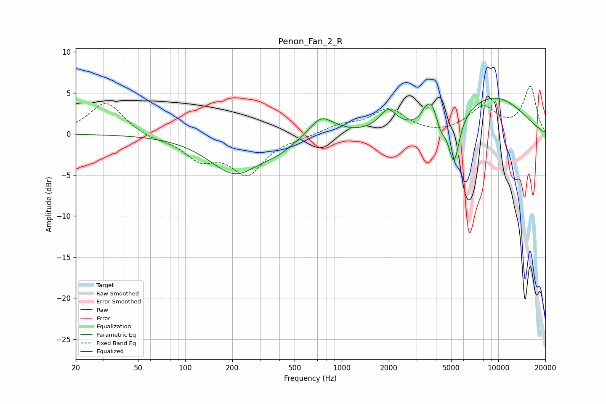

# Penon_Fan_2_R
See [usage instructions](https://github.com/jaakkopasanen/AutoEq#usage) for more options and info.

### Parametric EQs
Apply preamp of -4.4 dB when using parametric equalizer.

|   # | Type    |   Fc (Hz) |    Q |   Gain (dB) |
|-----|---------|-----------|------|-------------|
|   1 | Peaking |       209 | 0.86 |        -4.7 |
|   2 | Peaking |       393 | 1.56 |        -0.9 |
|   3 | Peaking |       738 | 1.99 |         2.3 |
|   4 | Peaking |       953 | 2.42 |         0.2 |
|   5 | Peaking |      1972 | 2.64 |         2.4 |
|   6 | Peaking |      3384 | 6    |         0.8 |
|   7 | Peaking |      3736 | 4.2  |         2.5 |
|   8 | Peaking |      4292 | 5.23 |        -1.2 |
|   9 | Peaking |      5213 | 3.91 |        -6.1 |
|  10 | Peaking |      9183 | 0.53 |         4.5 |

### Fixed Band EQs
When using fixed band (also called graphic) equalizer, apply preamp of **-5.9 dB** (if available) and set gains manually with these parameters.

|   # | Type    |   Fc (Hz) |    Q |   Gain (dB) |
|-----|---------|-----------|------|-------------|
|   1 | Peaking |        31 | 1.41 |         3.9 |
|   2 | Peaking |        62 | 1.41 |        -0.6 |
|   3 | Peaking |       125 | 1.41 |        -2.7 |
|   4 | Peaking |       250 | 1.41 |        -4.6 |
|   5 | Peaking |       500 | 1.41 |        -0.3 |
|   6 | Peaking |      1000 | 1.41 |         1   |
|   7 | Peaking |      2000 | 1.41 |         2.9 |
|   8 | Peaking |      4000 | 1.41 |        -0.2 |
|   9 | Peaking |      8000 | 1.41 |         3.1 |
|  10 | Peaking |     16000 | 1.41 |         5.7 |

### Graphs

