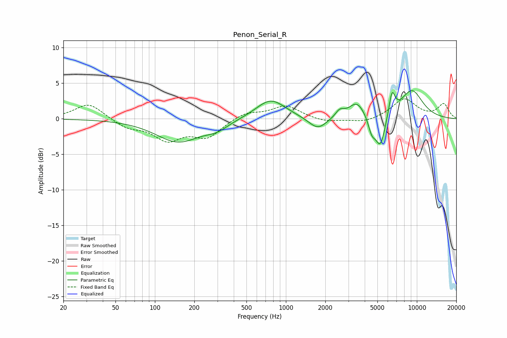

# Penon_Serial_R
See [usage instructions](https://github.com/jaakkopasanen/AutoEq#usage) for more options and info.

### Parametric EQs
Apply preamp of -4.1 dB when using parametric equalizer.

|   # | Type    |   Fc (Hz) |    Q |   Gain (dB) |
|-----|---------|-----------|------|-------------|
|   1 | Peaking |       150 | 0.83 |        -3.2 |
|   2 | Peaking |       296 | 1.67 |        -1   |
|   3 | Peaking |       765 | 1.26 |         2.8 |
|   4 | Peaking |      1751 | 2.05 |        -1.8 |
|   5 | Peaking |      2574 | 4.33 |         1   |
|   6 | Peaking |      3487 | 2.28 |         2.3 |
|   7 | Peaking |      4525 | 5.15 |        -2   |
|   8 | Peaking |      5264 | 3.57 |        -4.5 |
|   9 | Peaking |      6460 | 5.86 |         3.3 |
|  10 | Peaking |      9144 | 1.46 |         4   |

### Fixed Band EQs
When using fixed band (also called graphic) equalizer, apply preamp of **-2.9 dB** (if available) and set gains manually with these parameters.

|   # | Type    |   Fc (Hz) |    Q |   Gain (dB) |
|-----|---------|-----------|------|-------------|
|   1 | Peaking |        31 | 1.41 |         2.2 |
|   2 | Peaking |        62 | 1.41 |        -1.2 |
|   3 | Peaking |       125 | 1.41 |        -2.8 |
|   4 | Peaking |       250 | 1.41 |        -2.4 |
|   5 | Peaking |       500 | 1.41 |         1   |
|   6 | Peaking |      1000 | 1.41 |         1.8 |
|   7 | Peaking |      2000 | 1.41 |        -0.5 |
|   8 | Peaking |      4000 | 1.41 |        -0.6 |
|   9 | Peaking |      8000 | 1.41 |         2.8 |
|  10 | Peaking |     16000 | 1.41 |         2   |

### Graphs

