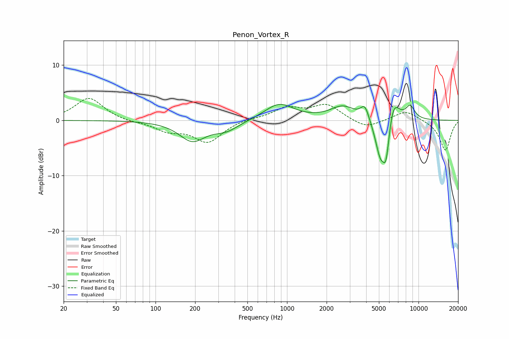

# Penon_Vortex_R
See [usage instructions](https://github.com/jaakkopasanen/AutoEq#usage) for more options and info.

### Parametric EQs
Apply preamp of -3.0 dB when using parametric equalizer.

|   # | Type    |   Fc (Hz) |    Q |   Gain (dB) |
|-----|---------|-----------|------|-------------|
|   1 | Peaking |       190 | 1.43 |        -3.6 |
|   2 | Peaking |       345 | 1.44 |        -1.6 |
|   3 | Peaking |       873 | 1.28 |         3   |
|   4 | Peaking |      2662 | 1.48 |         2.4 |
|   5 | Peaking |      3904 | 4.55 |         2.4 |
|   6 | Peaking |      4961 | 3.52 |        -3.9 |
|   7 | Peaking |      5174 | 6    |        -2   |
|   8 | Peaking |      5656 | 4.97 |        -7.6 |
|   9 | Peaking |      6424 | 3.05 |         4.4 |
|  10 | Peaking |      8643 | 3.7  |         2.3 |

### Fixed Band EQs
When using fixed band (also called graphic) equalizer, apply preamp of **-4.1 dB** (if available) and set gains manually with these parameters.

|   # | Type    |   Fc (Hz) |    Q |   Gain (dB) |
|-----|---------|-----------|------|-------------|
|   1 | Peaking |        31 | 1.41 |         4.1 |
|   2 | Peaking |        62 | 1.41 |        -0.3 |
|   3 | Peaking |       125 | 1.41 |        -1.7 |
|   4 | Peaking |       250 | 1.41 |        -3.8 |
|   5 | Peaking |       500 | 1.41 |         0.3 |
|   6 | Peaking |      1000 | 1.41 |         2.1 |
|   7 | Peaking |      2000 | 1.41 |         2.7 |
|   8 | Peaking |      4000 | 1.41 |        -1.5 |
|   9 | Peaking |      8000 | 1.41 |         1.8 |
|  10 | Peaking |     16000 | 1.41 |        -5.5 |

### Graphs

