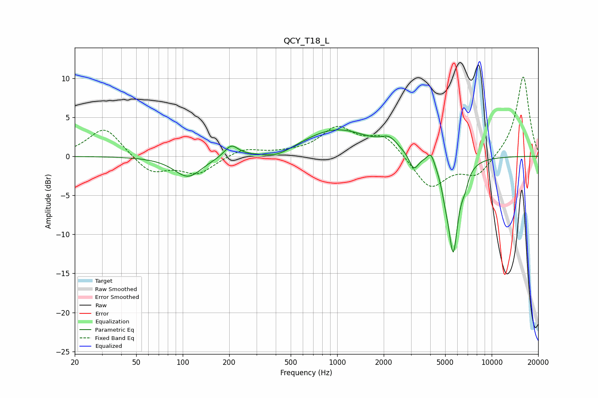

# QCY_T18_L
See [usage instructions](https://github.com/jaakkopasanen/AutoEq#usage) for more options and info.

### Parametric EQs
Apply preamp of -3.5 dB when using parametric equalizer.

|   # | Type    |   Fc (Hz) |    Q |   Gain (dB) |
|-----|---------|-----------|------|-------------|
|   1 | Peaking |       108 | 1.58 |        -2.7 |
|   2 | Peaking |       206 | 3.19 |         1.6 |
|   3 | Peaking |       413 | 1.52 |        -0.9 |
|   4 | Peaking |       993 | 0.65 |         3.5 |
|   5 | Peaking |      2174 | 2.73 |         1.3 |
|   6 | Peaking |      3133 | 4.68 |        -2.1 |
|   7 | Peaking |      4043 | 6    |         1.5 |
|   8 | Peaking |      5001 | 5.99 |        -1.5 |
|   9 | Peaking |      5631 | 4.1  |       -12   |
|  10 | Peaking |      6701 | 6    |        -1.4 |

### Fixed Band EQs
When using fixed band (also called graphic) equalizer, apply preamp of **-10.2 dB** (if available) and set gains manually with these parameters.

|   # | Type    |   Fc (Hz) |    Q |   Gain (dB) |
|-----|---------|-----------|------|-------------|
|   1 | Peaking |        31 | 1.41 |         3.8 |
|   2 | Peaking |        62 | 1.41 |        -2.2 |
|   3 | Peaking |       125 | 1.41 |        -2.2 |
|   4 | Peaking |       250 | 1.41 |         1   |
|   5 | Peaking |       500 | 1.41 |         0.3 |
|   6 | Peaking |      1000 | 1.41 |         3.4 |
|   7 | Peaking |      2000 | 1.41 |         2.6 |
|   8 | Peaking |      4000 | 1.41 |        -4.2 |
|   9 | Peaking |      8000 | 1.41 |        -2.5 |
|  10 | Peaking |     16000 | 1.41 |        10.4 |

### Graphs

