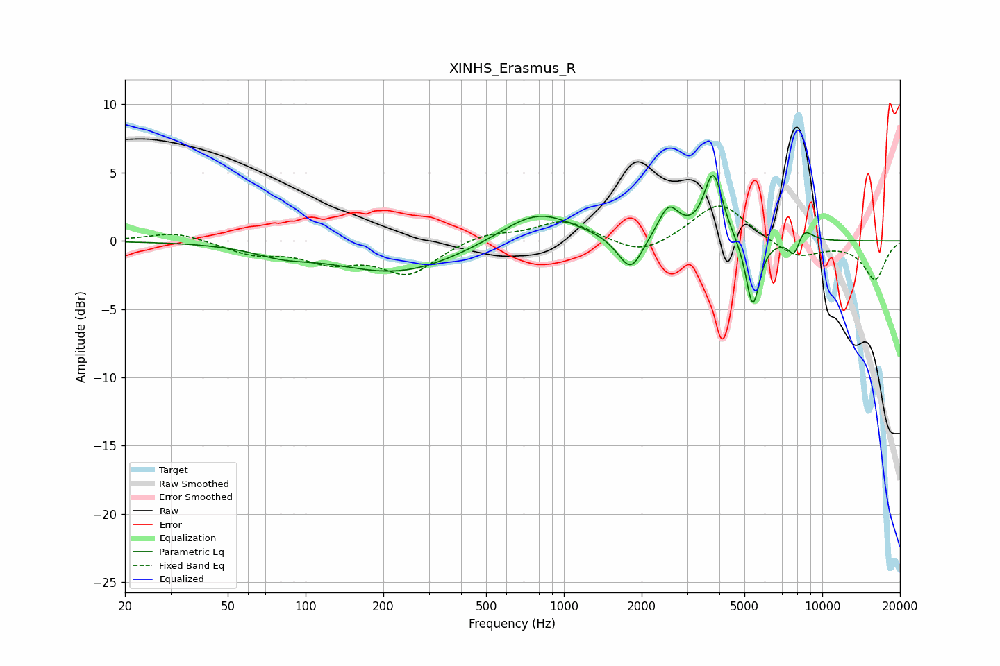

# XINHS_Erasmus_R
See [usage instructions](https://github.com/jaakkopasanen/AutoEq#usage) for more options and info.

### Parametric EQs
Apply preamp of -4.9 dB when using parametric equalizer.

|   # | Type    |   Fc (Hz) |    Q |   Gain (dB) |
|-----|---------|-----------|------|-------------|
|   1 | Peaking |        81 | 1.28 |        -0.6 |
|   2 | Peaking |       227 | 0.58 |        -2.3 |
|   3 | Peaking |       789 | 0.99 |         2.4 |
|   4 | Peaking |      1702 | 2.83 |        -0.6 |
|   5 | Peaking |      1830 | 3.27 |        -2.1 |
|   6 | Peaking |      2545 | 3.44 |         2.3 |
|   7 | Peaking |      3788 | 3.94 |         4.9 |
|   8 | Peaking |      5383 | 5.19 |        -5.1 |
|   9 | Peaking |      7789 | 5.92 |        -1.4 |
|  10 | Peaking |      8464 | 3.92 |         1.1 |

### Fixed Band EQs
When using fixed band (also called graphic) equalizer, apply preamp of **-2.6 dB** (if available) and set gains manually with these parameters.

|   # | Type    |   Fc (Hz) |    Q |   Gain (dB) |
|-----|---------|-----------|------|-------------|
|   1 | Peaking |        31 | 1.41 |         0.7 |
|   2 | Peaking |        62 | 1.41 |        -0.9 |
|   3 | Peaking |       125 | 1.41 |        -1.3 |
|   4 | Peaking |       250 | 1.41 |        -2.3 |
|   5 | Peaking |       500 | 1.41 |         0.6 |
|   6 | Peaking |      1000 | 1.41 |         1.5 |
|   7 | Peaking |      2000 | 1.41 |        -1.2 |
|   8 | Peaking |      4000 | 1.41 |         2.9 |
|   9 | Peaking |      8000 | 1.41 |        -1.3 |
|  10 | Peaking |     16000 | 1.41 |        -2.8 |

### Graphs

