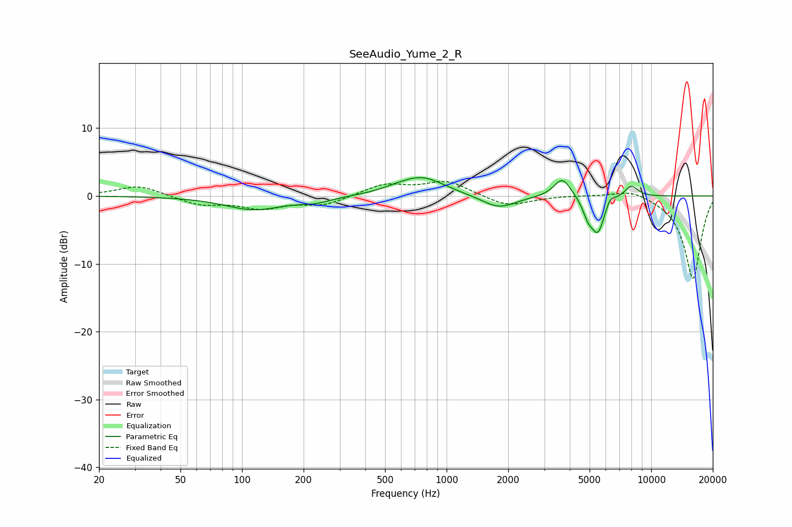

# SeeAudio_Yume_2_R
See [usage instructions](https://github.com/jaakkopasanen/AutoEq#usage) for more options and info.

### Parametric EQs
Apply preamp of -2.8 dB when using parametric equalizer.

|   # | Type    |   Fc (Hz) |    Q |   Gain (dB) |
|-----|---------|-----------|------|-------------|
|   1 | Peaking |       114 | 1    |        -2   |
|   2 | Peaking |       228 | 1.79 |        -0.7 |
|   3 | Peaking |       558 | 1.99 |         0.3 |
|   4 | Peaking |       756 | 1.27 |         2.8 |
|   5 | Peaking |      1799 | 1.7  |        -1.9 |
|   6 | Peaking |      3685 | 3.34 |         2.9 |
|   7 | Peaking |      4895 | 5.97 |        -1.8 |
|   8 | Peaking |      5483 | 3.9  |        -5.5 |
|   9 | Peaking |      6280 | 6    |         1.3 |
|  10 | Peaking |      7983 | 3.94 |         1.7 |

### Fixed Band EQs
When using fixed band (also called graphic) equalizer, apply preamp of **-2.2 dB** (if available) and set gains manually with these parameters.

|   # | Type    |   Fc (Hz) |    Q |   Gain (dB) |
|-----|---------|-----------|------|-------------|
|   1 | Peaking |        31 | 1.41 |         1.6 |
|   2 | Peaking |        62 | 1.41 |        -1.3 |
|   3 | Peaking |       125 | 1.41 |        -1.7 |
|   4 | Peaking |       250 | 1.41 |        -1.3 |
|   5 | Peaking |       500 | 1.41 |         1.7 |
|   6 | Peaking |      1000 | 1.41 |         2.1 |
|   7 | Peaking |      2000 | 1.41 |        -1.6 |
|   8 | Peaking |      4000 | 1.41 |         0.1 |
|   9 | Peaking |      8000 | 1.41 |         1.1 |
|  10 | Peaking |     16000 | 1.41 |       -12.3 |

### Graphs

