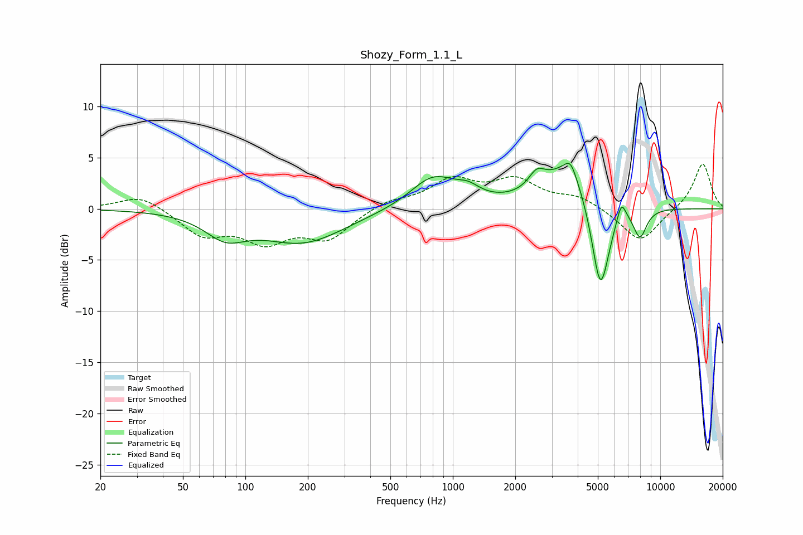

# Shozy_Form_1.1_L
See [usage instructions](https://github.com/jaakkopasanen/AutoEq#usage) for more options and info.

### Parametric EQs
Apply preamp of -4.5 dB when using parametric equalizer.

|   # | Type    |   Fc (Hz) |    Q |   Gain (dB) |
|-----|---------|-----------|------|-------------|
|   1 | Peaking |        80 | 1.44 |        -2.2 |
|   2 | Peaking |       189 | 0.7  |        -3.2 |
|   3 | Peaking |       806 | 1.27 |         3.1 |
|   4 | Peaking |      1186 | 2.47 |         1   |
|   5 | Peaking |      2542 | 3.53 |         1.6 |
|   6 | Peaking |      3657 | 1.2  |         4.5 |
|   7 | Peaking |      3690 | 5.09 |         1.4 |
|   8 | Peaking |      5144 | 3.08 |        -9.6 |
|   9 | Peaking |      6494 | 6    |         2.1 |
|  10 | Peaking |      7992 | 4.19 |        -2.7 |

### Fixed Band EQs
When using fixed band (also called graphic) equalizer, apply preamp of **-4.4 dB** (if available) and set gains manually with these parameters.

|   # | Type    |   Fc (Hz) |    Q |   Gain (dB) |
|-----|---------|-----------|------|-------------|
|   1 | Peaking |        31 | 1.41 |         1.4 |
|   2 | Peaking |        62 | 1.41 |        -2.4 |
|   3 | Peaking |       125 | 1.41 |        -2.9 |
|   4 | Peaking |       250 | 1.41 |        -2.8 |
|   5 | Peaking |       500 | 1.41 |         0.8 |
|   6 | Peaking |      1000 | 1.41 |         2.6 |
|   7 | Peaking |      2000 | 1.41 |         2.6 |
|   8 | Peaking |      4000 | 1.41 |         1.1 |
|   9 | Peaking |      8000 | 1.41 |        -3.3 |
|  10 | Peaking |     16000 | 1.41 |         4.5 |

### Graphs

