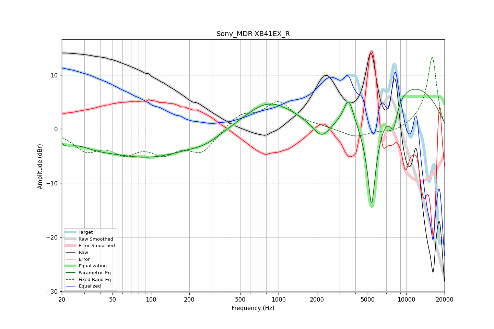

# Sony_MDR-XB41EX_R
See [usage instructions](https://github.com/jaakkopasanen/AutoEq#usage) for more options and info.

### Parametric EQs
Apply preamp of -7.4 dB when using parametric equalizer.

|   # | Type    |   Fc (Hz) |    Q |   Gain (dB) |
|-----|---------|-----------|------|-------------|
|   1 | Peaking |        22 | 2.84 |        -1.3 |
|   2 | Peaking |        37 | 0.92 |        -1.4 |
|   3 | Peaking |        97 | 0.44 |        -4.9 |
|   4 | Peaking |       266 | 1.08 |        -1.4 |
|   5 | Peaking |       832 | 0.74 |         5   |
|   6 | Peaking |      2176 | 1.88 |        -3.8 |
|   7 | Peaking |      3539 | 3.9  |         4.5 |
|   8 | Peaking |      5358 | 3.28 |       -20   |
|   9 | Peaking |      7927 | 3.98 |        -5   |
|  10 | Peaking |     10000 | 0.34 |         8.5 |

### Fixed Band EQs
When using fixed band (also called graphic) equalizer, apply preamp of **-13.4 dB** (if available) and set gains manually with these parameters.

|   # | Type    |   Fc (Hz) |    Q |   Gain (dB) |
|-----|---------|-----------|------|-------------|
|   1 | Peaking |        31 | 1.41 |        -3.5 |
|   2 | Peaking |        62 | 1.41 |        -3.6 |
|   3 | Peaking |       125 | 1.41 |        -3.7 |
|   4 | Peaking |       250 | 1.41 |        -4.1 |
|   5 | Peaking |       500 | 1.41 |         2.6 |
|   6 | Peaking |      1000 | 1.41 |         4.8 |
|   7 | Peaking |      2000 | 1.41 |         0.3 |
|   8 | Peaking |      4000 | 1.41 |        -1.6 |
|   9 | Peaking |      8000 | 1.41 |        -0.8 |
|  10 | Peaking |     16000 | 1.41 |        13.4 |

### Graphs

