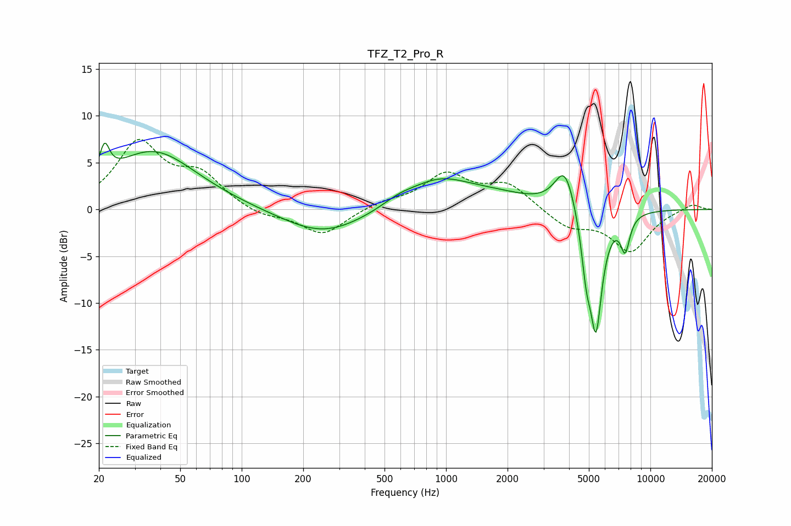

# TFZ_T2_Pro_R
See [usage instructions](https://github.com/jaakkopasanen/AutoEq#usage) for more options and info.

### Parametric EQs
Apply preamp of -7.2 dB when using parametric equalizer.

|   # | Type    |   Fc (Hz) |    Q |   Gain (dB) |
|-----|---------|-----------|------|-------------|
|   1 | Peaking |        21 | 5.97 |         3.2 |
|   2 | Peaking |        37 | 0.66 |         6.2 |
|   3 | Peaking |       250 | 0.71 |        -2.8 |
|   4 | Peaking |       583 | 1.74 |         0.7 |
|   5 | Peaking |       922 | 0.92 |         2.9 |
|   6 | Peaking |      1778 | 0.76 |         1.2 |
|   7 | Peaking |      3817 | 2.78 |         4.6 |
|   8 | Peaking |      4857 | 5.79 |        -4.5 |
|   9 | Peaking |      5416 | 4.39 |       -12.6 |
|  10 | Peaking |      7526 | 5.87 |        -3.6 |

### Fixed Band EQs
When using fixed band (also called graphic) equalizer, apply preamp of **-7.6 dB** (if available) and set gains manually with these parameters.

|   # | Type    |   Fc (Hz) |    Q |   Gain (dB) |
|-----|---------|-----------|------|-------------|
|   1 | Peaking |        31 | 1.41 |         6.9 |
|   2 | Peaking |        62 | 1.41 |         3.3 |
|   3 | Peaking |       125 | 1.41 |        -0.8 |
|   4 | Peaking |       250 | 1.41 |        -2.8 |
|   5 | Peaking |       500 | 1.41 |         0.7 |
|   6 | Peaking |      1000 | 1.41 |         3.6 |
|   7 | Peaking |      2000 | 1.41 |         2.6 |
|   8 | Peaking |      4000 | 1.41 |        -1.9 |
|   9 | Peaking |      8000 | 1.41 |        -4.4 |
|  10 | Peaking |     16000 | 1.41 |         0.7 |

### Graphs

